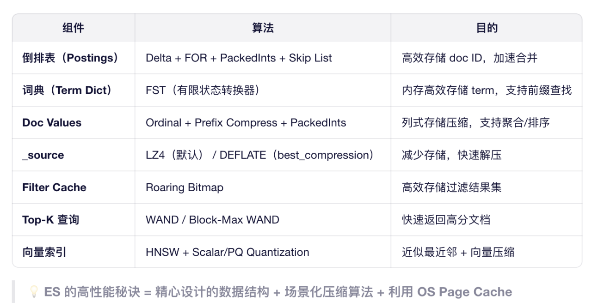

# ES 总结

## 写入流程
### 请求路由与校验（入口）
1. 客户端发请求（单条/_index或批量/_bulk），协调节点按_id哈希值路由到主分片（公式：shard = hash(_routing) % 主分片数，_routing默认是_id）；
2. 校验请求合法性（字段类型、索引权限、分片是否活跃），非法直接返回。

### 主分片核心写入（核心步骤）

遵循“日志优先，安全第一”原则，分四步：

1. 写Translog：先将文档追加写入Translog（磁盘追加写，速度快），此时数据已具备崩溃恢复能力；
2. 写内存缓冲区：文档写入内存缓冲区，此时文档暂不可检索；
3. 触发Refresh：默认1秒后，内存缓冲区数据刷入“内存Segment”，Segment被加入检索列表，文档变为可检索（近实时的核心）；
4. 同步副本：主分片将请求同步到所有副本分片，副本重复“写Translog→写缓冲区→Refresh”流程，确保数据一致性。

### 响应与后续异步操作

- 所有副本确认写入成功后，主分片通过协调节点向客户端返回“成功”；

- 异步Flush：当Translog达到阈值（默认512MB）或30分钟后，触发Flush：将内存Segment落盘（持久化）、清空缓冲区、生成新Translog（旧日志可删除）；

- Segment合并：后台线程异步将多个小Segment合并为大Segment（减少文件数，优化检索性能），合并后旧Segment标记删除，最终释放磁盘空间。
  
## 请求流程
1. 客户端发送请求到任意节点（成为协调节点）
  该节点自动成为本次请求的 协调节点（Coordinating Node）。
2. 协调节点解析请求，确定目标分片
  根据索引名（如 my_index）获取其 分片分布信息（从集群元数据缓存中读取）；
  协调节点会选择 每个分片的一个副本（主或副）来查询，以实现负载均衡。
> 默认策略：轮询选择可用副本（避免只查主分片）。
3. 协调节点向相关分片所在数据节点广播“查询阶段”（Query Phase）
  🔸 查询阶段（Query Phase）—— 轻量级，收集候选文档 ID 和排序值
  协调节点向 每个目标分片（如 P0/R0, P1/R1, P2/R2）发送相同的查询请求；
  每个分片在本地执行查询：
  使用倒排索引快速匹配文档；
  对命中文档计算 相关性得分（_score） 或按指定字段排序；
  仅返回文档 ID + 排序值（如 _score），不加载完整文档内容；
  构建一个 优先队列（Priority Queue），大小为 from + size（例如 from=0, size=10 → 取 top 10）；
  每个分片将这个 局部 top-N 列表 返回给协调节点。
> 注意：即使你只要 10 条，每个分片也会返回 10 条（后续会全局排序再截断）。

4. 协调节点合并结果，确定最终文档 ID 列表
协调节点收到所有分片的局部结果（如 3 个分片 × 10 条 = 30 条）；
将这些结果 全局排序（按 _score 或自定义 sort）；
根据 from 和 size 截取最终需要的文档 ID（如第 0~9 条）；
> 得到一个 最终文档 ID 列表（例如：[doc5, doc12, doc3, ...]）。

5. 协调节点发起“获取阶段”（Fetch Phase）
获取阶段（Fetch Phase）—— 拉取完整文档内容
协调节点根据最终文档 ID 列表，再次向对应分片所在节点发送请求，要求获取完整 _source（或指定字段）；
每个数据节点根据文档 ID 从 正排索引（Doc Values 或 _source） 中读取原始数据；
返回完整的文档内容给协调节点。
> 如果查询中使用了 stored_fields 或 _source 过滤，只返回所需字段，减少网络传输。

步骤 6：协调节点组装最终响应，返回给客户端
将所有文档按顺序组装成 JSON 数组；
添加总命中数（hits.total）、耗时等元信息；
返回给客户端。

## 分片索引设计
- 分片合理 节点数*3、副本合理 副本多利于查询降低写入
- mapping 精简：关闭无用字段的索引	"index": false（如日志中的 trace_id 只用于展示）
- 使用 keyword 替代 text	精确匹配字段（如 status, country）用 keyword，避免分词
- 时间戳字段务必用 date 类型（支持高效 range 查询）。
- 自定义分词器，配置停用词的文件

## 查询优化
- 过滤结果不计算相关性得分（_score = 0），且结果可被 Query Cache 缓存；
- 用 bool.filter 代替 bool.must（当不需要打分时）
- search_after 分页
- 限制字段返回使用 _source 过滤

- 缓存利用	固定查询开 request_cache，避免动态时间
- 集群架构	角色分离、SSD、副本按需配置
- 硬件资源	堆内存 ≤ 31G，锁内存，留足 Page Cache
- 持续监控	Profile 慢查询，跟踪 cache 命中率