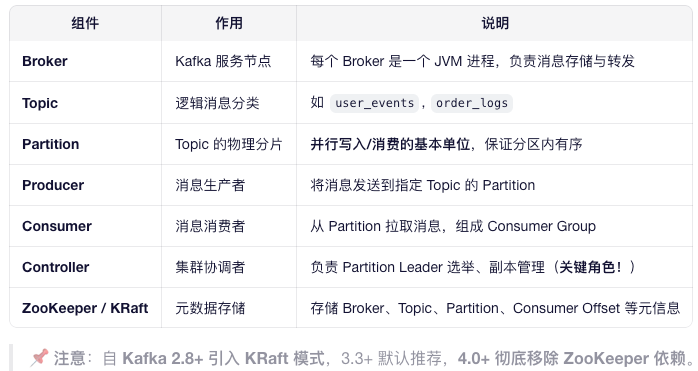
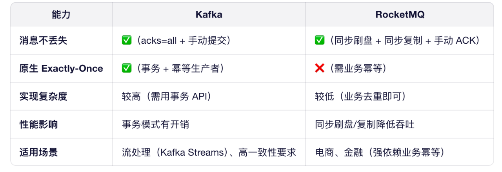
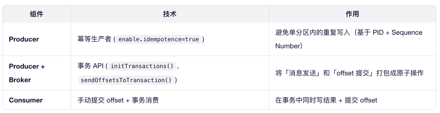

# Kafka

## 集群原理


### 1. **Partition 分布与 Leader 选举**

* 每个 Topic 被分为 N 个 Partition（如 6 个）
* 每个 Partition 有 **1 个 Leader + 多个 Follower**
* Partition 均匀分布在不同 Broker 上（避免单点热点）


* ​**Leader 职责**​：处理所有读写请求
* ​**Follower 职责**​：从 Leader 拉取数据，保持同步

---

### 2. **ISR（In-Sync Replicas）机制 —— 一致性保障**

* ​**ISR 集合**​：与 Leader 保持同步的副本列表（默认 10 秒未同步则踢出）
* ​**acks 配置**​：
    * `acks=1`：Leader 写成功即返回（可能丢数据）
    * `acks=all`：​**所有 ISR 副本写成功才返回**​（强一致）
* ​**HW（High Watermark）**​：已提交消息的最大 offset，Consumer 只能读到 HW

> 💡 ​**故障恢复**​：
> 若 Leader 宕机，Controller 从 ​**ISR 中选新 Leader**​（保证不丢数据）

---

### 3. **Controller 角色（集群大脑）**

* ​**职责**​：
    * 监听 Broker 上下线
    * 触发 Partition Rebalance
    * 管理 Replica 状态机
    * 处理 Topic 创建/删除
* ​**高可用**​：KRaft 模式下，Controller 本身通过 **Raft 协议**实现多副本选举


## 对比 MQ 


## Exactly-Once 端到端


## 关键机制：sendOffsetsToTransaction()
```java


// 伪代码：事务性消费-处理-提交
consumer.subscribe("input-topic");
producer.initTransactions();

while (true) {
ConsumerRecords records = consumer.poll();

    producer.beginTransaction();
    
    // 1. 处理消息并发送结果到 output-topic
    for (record : records) {
        Result r = process(record);
        producer.send(new ProducerRecord("output-topic", r));
    }
    
    // 2. ⭐️ 将当前 offset 提交到事务中（非立即生效）
    producer.sendOffsetsToTransaction(
        consumer.position(), 
        consumer.groupMetadata()
    );
    
    // 3. 提交整个事务（消息 + offset 原子生效）
    producer.commitTransaction(); 
}
```

## 具体流程
Kafka 事务的完整流程分为初始化、事务执行、提交 / 中止三个阶段，以 “生产者跨分区写消息” 为例：
1. 初始化阶段：生产者与协调器建立关联
生产者配置 transactional.id 和 enable.idempotence=true（事务依赖幂等性），启动时首先向 Kafka 集群发送请求，获取 / 绑定 PID（事务 ID 固定对应一个 PID，重启后复用）。
协调器为该 PID 初始化事务状态（初始为 Empty），并恢复该事务 ID 之前未完成的事务（若有，自动中止，避免事务悬挂）。
2. 事务执行阶段：发送事务内消息
生产者调用 beginTransaction()，向协调器发送 “开始事务” 请求，协调器更新事务状态为 Ongoing，并记录事务超时时间（避免长事务阻塞）。
生产者向多个分区 / 主题发送消息：
消息会被标记为 “事务内消息”（包含 PID、事务 ID、Sequence Number可用来去重）；
消息先写入对应分区的日志，但此时处于 “未提交” 状态，消费者默认看不到（除非配置 isolation.level=read_uncommitted）。
（可选）消费 - 生产场景：若生产者同时是消费者（如 Stream 任务），需调用 sendOffsetsToTransaction()，将消费的 offset 提交到协调器（作为事务的一部分，保证 “消费 - 生产” 原子性）。
3. 提交 / 中止阶段：原子性确认
（1）提交事务（commitTransaction ()）
Kafka 采用 “两阶段提交（2PC）” 保证事务原子性：
第一阶段（Prepare）：生产者向协调器发送 “准备提交” 请求，协调器收集该事务涉及的所有分区（称为 “事务分区集”），并向每个分区的 leader 发送 “PrepareCommit” 请求；
第二阶段（Commit）：协调器等待所有分区响应 Prepare 成功后，将事务状态更新为 Committed（持久化到 __transaction_state），并向所有事务分区发送 “Commit” 请求；
分区 leader 收到 Commit 后，标记事务内消息为 “已提交”，消费者（默认 isolation.level=read_committed）可读取这些消息；
生产者收到协调器的提交确认后，完成事务。
（2）中止事务（abortTransaction ()）
生产者发送 “中止事务” 请求，协调器将事务状态更新为 Aborted（持久化到 __transaction_state）；
协调器向所有事务分区发送 “Abort” 请求，分区 leader 标记事务内消息为 “已中止”，这些消息会被清理，消费者永远看不到；
生产者收到中止确认后，事务失败，数据回滚。

## kafka 控制器
在 Kafka 集群中会有一个或多个 broker，其中有一个 broker 会被选举为控制器，它负责管理整个集群中所有分区和副本的状态，kafka 集群中只能有一个控制器。
当某个分区的 leader 副本出现故障时，由控制器负责为该分区选举新的 leader 副本。当检测到某个分区的ISR集合发生变化时，由控制器负责通知所有 broker 更新其元数据信息。当为某个 topic 增加分区数量时，由控制器负责分区的重新分配

## kafka 为什么快
1. 顺序读写磁盘分为顺序读写与随机读写，基于磁盘的随机读写确实很慢，但磁盘的顺序读写性能却很高，kafka 这里采用的就是顺序读写。
2. Page Cache为了优化读写性能，Kafka 利用了操作系统本身的 Page Cache，就是利用操作系统自身的内存而不是JVM空间内存。Page Cache 就是当往磁盘文件写入的时候，系统会先将数据流写入缓存中，但是什么时候将缓存的数据写入文件中是由操作系统自行决定。所以如果此时机器突然挂了，也是会丢失消息的。
这个和Java NIO中的内存映射基本相同，mmf （Memory Mapped Files）直接利用操作系统的Page来实现文件到物理内存的映射，完成之后对物理内存的操作会直接同步到硬盘。
3. 零拷贝Kafka使用了零拷贝技术，也就是直接将数据从内核空间的读缓冲区直接拷贝到内核空间的 socket 缓冲区，然后再写入到 NIC 缓冲区，避免了在内核空间和用户空间之间穿梭。虚拟内存，可以把内核空间地址和用户空间的虚拟地址映射到同一个物理地址
4. 分区分段+索引Kafka 的 message 是按 topic分 类存储的，topic 中的数据又是按照一个一个的 partition 即分区存储到不同 broker 节点。每个 partition 对应了操作系统上的一个文件夹，partition 实际上又是按照segment分段存储的。通过这种分区分段的设计，Kafka 的 message 消息实际上是分布式存储在一个一个小的 segment 中的，每次文件操作也是直接操作的 segment。为了进一步的查询优化，Kafka 又默认为分段后的数据文件建立了索引文件，就是文件系统上的.index文件。这种分区分段+索引的设计，不仅提升了数据读取的效率，同时也提高了数据操作的并行度。
5. 批量读写
6. 批量压缩

## Zk 是如何保证数据一致性的？
Zookeeper通过ZAB原子广播协议来实现数据的最终顺序一致性，他是一个类似2PC两阶段提交的过程。
由于Zookeeper只有Leader节点可以写入数据，如果是其他节点收到写入数据的请求，则会将之转发给Leader节点。
主要流程如下：
1. Leader收到请求之后，将它转换为一个proposal提议，并且为每个提议分配一个全局唯一递增的事务ID：zxid，然后把提议放入到一个FIFO的队列中，按照FIFO的策略发送给所有的Follower
2. Follower收到提议之后，以事务日志的形式写入到本地磁盘中，写入成功后返回ACK给Leader
3. Leader在收到超过半数的Follower的ACK之后，即可认为数据写入成功，就会发送commit命令给Follower告诉他们可以提交proposal了
## ZAB 协议：
ZAB 协议是为分布式协调服务 Zookeeper 专门设计的一种支持崩溃恢复的原子广播协议，实现分布式数据一致性
所有客户端的请求都是写入到 Leader 进程中，然后，由 Leader 同步到其他节点，称为 Follower。在集群数据同步的过程中，如果出现 Follower 节点崩溃或者 Leader 进程崩溃时，都会通过 Zab 协议来保证数据一致性ZAB 协议包括两种基本的模式：崩溃恢复和消息广播，消息广播：Leader 节点的写入是一个两步操作，第一步是广播事务操作，第二步是广播提交操作，其中过半数指的是反馈的节点数 >=N/2+1。崩溃恢复：初始化集群，刚刚启动的时候Leader 崩溃，因为故障宕机Leader 失去了半数的机器支持，与集群中超过一半的节点断连此时开启新一轮 Leader 选举，选举产生的 Leader 会与过半的 Follower 进行同步，使数据一致，当与过半的机器同步完成后，就退出恢复模式， 然后进入消息广播模式
整个 ZooKeeper 集群的一致性保证就是在上面两个状态之前切换，当 Leader 服务正常时，就是正常的消息广播模式；当 Leader 不可用时，则进入崩溃恢复模式，崩溃恢复阶段会进行数据同步，完成以后，重新进入消息广播阶段。
## Leader选举
Zxid是极为重要的概念，它是一个long型（64位）整数，分为两部分：纪元（epoch）部分和计数器（counter）部分，是一个全局有序的数字。
epoch代表当前集群所属的哪个leader，leader的选举就类似一个朝代的更替，你前朝的剑不能斩本朝的官，用epoch代表当前命令的有效性，counter是一个递增的数字。
当其他节点的纪元比自身高投它，如果纪元相同比较自身的

1. 变更状态。Leader 挂后，余下的非 Observer 服务器都会讲自己的服务器状态变更为 LOOKING，然后开始进入 Leader 选举过程。

2. 每个非 Observer 的 Server 会发出一个投票。和启动过程一致。

3. 接收来自各个服务器的投票。与启动时过程相同。

4. 处理投票。与启动时过程相同。

5. 统计投票。与启动时过程相同。

6. 改变服务器的状态。与启动时过程相同。