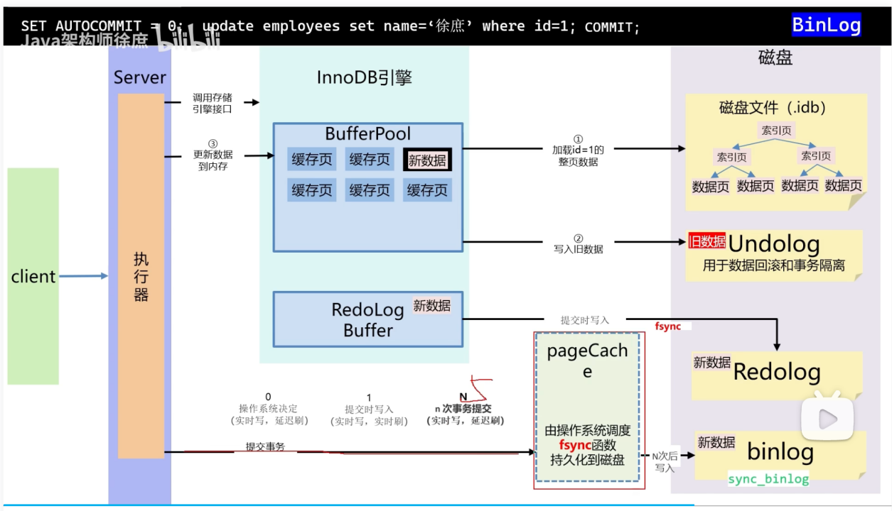

# MySQL
## B+ 树可以存放多少行数据
这里我们先假设 B+ 树高为 2，即存在一个根节点和若干个叶子节点，那么这棵 B+ 树的存放总记录数为：根节点指针数 * 单个叶子节点记录行数。
上文我们已经说明单个叶子节点（页）中的记录数 =16K/1K=16。（这里假设一行记录的数据大小为 1k，实际上现在很多互联网业务数据记录大小通常就是 1K 左右）。
那么现在我们需要计算出非叶子节点能存放多少指针？
其实这也很好算，我们假设主键 ID 为 bigint 类型，长度为 8 字节，而指针大小在 InnoDB 源码中设置为 6 字节，这样一共 14 字节，我们一个页中能存放多少这样的单元，其实就代表有多少指针，即 16384/14=1170。
那么可以算出一棵高度为 2 的 B+ 树，能存放 1170*16=18720 条这样的数据记录。
根据同样的原理我们可以算出一个高度为 3 的 B+ 树可以存放： 1170*1170*16=21902400 条这样的记录。
所以在 InnoDB 中 B+ 树高度一般为 1-3 层，它就能满足千万级的数据存储。
在查找数据时一次页的查找代表一次 IO，所以通过主键索引查询通常只需要 1-3 次 IO 操作即可查找到数据。

## MVCC
InnoDB 存储引擎实现 **高并发读写、避免锁阻塞** 的核心技术。它通过为数据行维护多个版本，让不同事务看到不同的“快照”，从而在保证隔离性的同时提升并发性能。

#### 🔧 核心原理：**基于 Undo Log + Read View**

1. **版本链构建**
    * 每次更新数据时，InnoDB 不会直接覆盖原数据，而是：
        * 将旧值写入 ​**Undo Log**​（生成新版本）
        * 在数据行上添加指向旧版本的指针，形成 **版本链（Version Chain）**
    * 比如：`id=1, name='A' → 'B' → 'C'`，链表结构为 `C → B → A`
2. **Read View（一致性视图）**
    * 事务开始时，InnoDB 会创建一个 ​**Read View**​，记录当前活跃事务列表
    * 它包含三个关键信息：
        * `m_ids`：当前所有活跃事务 ID 列表
        * `min_trx_id`：最小活跃事务 ID
        * `max_trx_id`：最大活跃事务 ID + 1
    * 读取数据时，根据版本链和 Read View 判断是否可见：
      ```
      if (row.trx_id < min_trx_id) { // 已提交，可见
      } else if (row.trx_id >= max_trx_id) { // 未提交，不可见
      } else if (row.trx_id in m_ids) { // 活跃事务，不可见
      } else { // 已提交且非活跃，可见 }
      ```
3. **快照读 vs 当前读**
    * ​**快照读**​（普通 `SELECT`）：使用 Read View，读取历史版本（不加锁）
    * ​**当前读**​（`UPDATE/DELETE/SELECT FOR UPDATE`）：读最新版本，并加锁
4. **垃圾回收（Purge）**
    * 事务提交后，其产生的旧版本不会立即删除
    * 由后台线程 `purge thread` 定期检查：若无事务依赖该版本，则清理
    * 避免 Undo Log 无限增长（可通过 `innodb_purge_rseg_truncate_frequency` 调整）

#### 🎯 实现效果：

* **读不阻塞写，写不阻塞读** → 极大提升并发性能
* ​**支持可重复读（RR）隔离级别**​：事务内多次读结果一致
* ​**RC 和 RR 的区别**​：
    * RC：每次 `SELECT` 创建新 Read View（可能看到其他事务提交的新数据）
    * RR：事务开始时创建一次 Read View（保证可重复读）

## Binlog,redolog,undolog

 MySQL 中有三类核心日志：​**Binlog（归档日志）、Redo Log（重做日志）、Undo Log（回滚日志）**​，它们分别位于 **Server 层** 和 ​**InnoDB 存储引擎层**​，协同实现 **事务 ACID、主从复制、崩溃恢复** 等关键能力。

> 1. **Binlog（二进制日志）**
     >    * ​**归属**​：MySQL Server 层（与存储引擎无关）
>    * ​**内容**​：记录所有​**逻辑操作**​（如 `INSERT/UPDATE/DELETE` 的 SQL 语句或行变更）
>    * ​**用途**​：
       >      * 主从复制（Slave 拉取 Binlog 重放）
>      * 基于时间点的数据恢复（`mysqlbinlog` 工具）
>    * ​**写入时机**​：事务提交时（`sync_binlog` 控制刷盘策略）
> 2. **Redo Log（重做日志）**
     >    * ​**归属**​：InnoDB 存储引擎特有
>    * ​**内容**​：记录​**物理页的修改**​（如“将 page X 的 offset Y 改为 Z”），是**物理日志**
>    * ​**核心原则**​：遵循 **WAL（Write-Ahead Logging）** —— 先写日志，再写磁盘
>    * ​**用途**​：
       >      * ​**崩溃恢复（Crash Safe）**​：宕机重启时，用 Redo Log 重放未刷盘的脏页，保证**已提交事务不丢失**
>    * ​**特点**​：循环写入（固定大小文件），提交前必须落盘（`innodb_flush_log_at_trx_commit=1`）
> 3. **Undo Log（回滚日志）**
     >    * ​**归属**​：InnoDB 存储引擎
>    * ​**内容**​：保存​**事务修改前的数据版本**​（旧值）
>    * ​**用途**​：
       >      * ​**事务回滚**​：执行 `ROLLBACK` 时恢复原始数据
>      * ​**MVCC（多版本并发控制）**​：为快照读（如 `SELECT`）提供一致性视图，避免读写阻塞
>    * ​**存储位置**​：早期在共享表空间，5.6+ 可独立为 `undo tablespace`
>
> ​**三者协作流程（以 UPDATE 为例）**​：
>
> 1. 事务开始，生成 Undo Log（用于回滚和 MVCC）
> 2. 修改 Buffer Pool 中的数据页（标记为脏页）
> 3. 写入 Redo Log（prepare 状态）
> 4. 写入 Binlog（Server 层）
> 5. Redo Log 提交（commit 状态）→ 事务成功
> 6. 后台线程异步刷脏页到磁盘
>
> 若中途崩溃，重启时通过 **Redo Log + Binlog 两阶段提交** 保证一致性。

---

关键细节

| 日志     | 是否支持 crash-safe            | 是否用于主从 | 是否可关闭                |
| ---------- | -------------------------------- | -------------- | --------------------------- |
| Binlog   | ❌（仅用于恢复，不保提交事务） | ✅           | 可（但失去复制/恢复能力） |
| Redo Log | ✅（核心保障）                 | ❌           | ❌（InnoDB 必须开启）     |
| Undo Log | ❌（用于回滚，非恢复）         | ❌           | ❌（事务必需）            |

> 💡 ​**两阶段提交（2PC）**​：
为保证 ​**Redo Log 与 Binlog 一致性**​，MySQL 采用 2PC：
>
> * ​**Prepare 阶段**​：写 Redo Log（prepare）
> * ​**Commit 阶段**​：写 Binlog → 写 Redo Log（commit）
    >   崩溃恢复时，若 Redo Log 有 prepare 但无 commit，则检查 Binlog 是否存在，不存在回滚 存在提交。


## 主从复制延迟
「半同步复制」（MySQL 5.5+）：主库写 binlog 后，需等待至少一个从库 IO 线程确认接收 binlog，再返回客户端 —— 解决异步复制的数据丢失问题，适合金融等对一致性要求高的场景

1. MySQL 5.6 版本以后，提供了一种「并行复制」的方式，通过将 SQL 线程转换为多个 work 线程来进行重放
2. 「提高从库机器配置」
3. 多个从库分担读压力，分析从库慢查询 
4. 在业务初期就选择合适的分库、分表策略，「避免单表单库过大」带来额外的复制压力 
5. 「避免长事务」 
6. 「避免让数据库进行各种大量运算」 
7. 延迟感知路由，应用层或中间件（如 ShardingSphere、MyCAT）根据延迟决定是否读从库
   - 延迟 < 1s → 允许读从库
   - 延迟 > 5s → 强制读主库
   - 对强一致性要求高的请求（如支付后查订单），直接读主库
8. 半同步复制：
   至少 1 个从库收到 Binlog 后，主库才返回成功
   不能减少延迟，但能保证故障切换时数据不丢
9. 紧急处理：
   - 读主库
   - 检查问题 SHOW PROCESSLIST：是否有大查询阻塞，iotop / top：从库 IO/CPU 是否打满
   - 重建从库（终极手段）

## 前模糊匹配索引失效如何解决
MySQL 8.0 索引跳跃扫描 联合索引将第一个字段分区

解决办法：
- 反向索引：将索引字段的值额外存储一份，不过值是经过反转后处理的，当查询时，将前模糊匹配也转成后模糊匹配
- 限制范围：如果可以增加额外的条件来过滤掉一部分，也可以提高性能
- 索引覆盖：如果查询结果刚好是索引字段，即使是全表扫描，也无需再回表，这样也可以提升一些性能
> 如果上述都不满足：则可以将数据同步到es，进行模糊查询
## 死锁解决方案

- 保持加锁的顺序
- 减少事务粒度
- 设置锁超时时间
- where条件走唯一索引
- 如果业务允许走 RC 隔离级别关闭间隙锁
- mysql本身会自动检测死锁，发生时会回滚一个代价最小的事务，