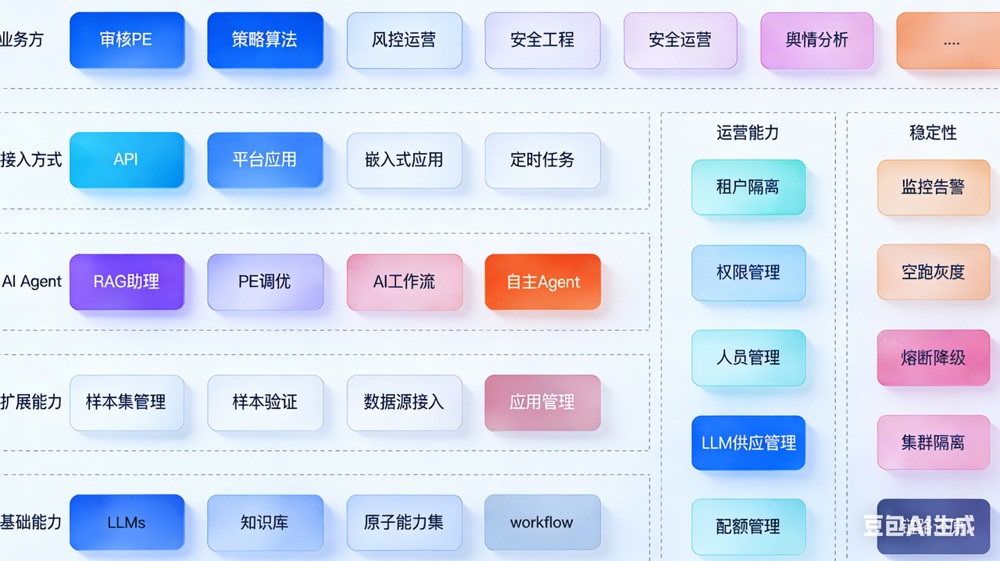
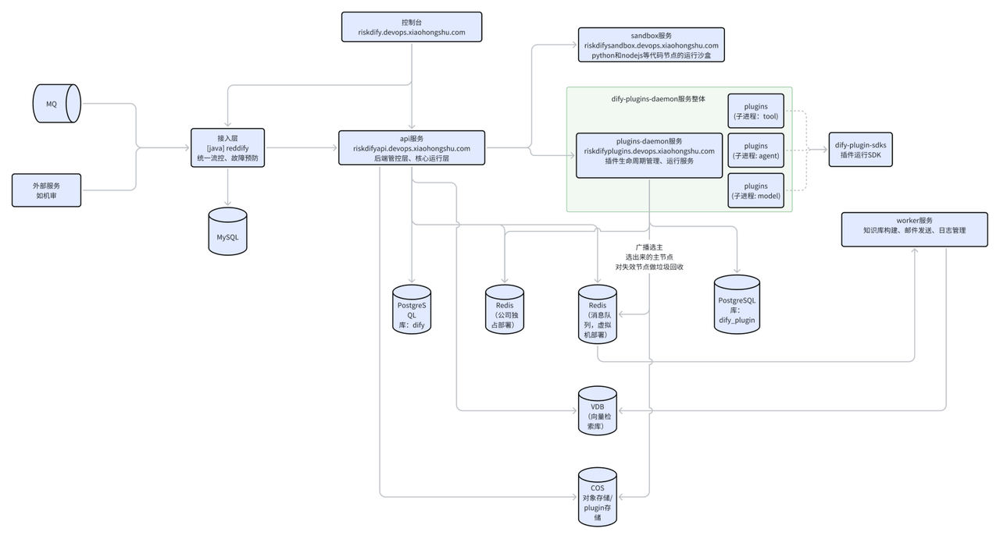
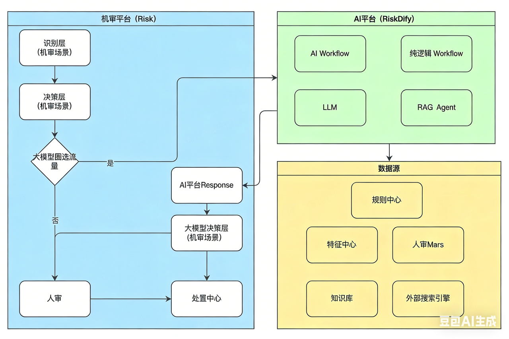

# Dify 部署开发

## AI平台

基于Dify平台定制化开发，一站式的大模型应用开发平台，提供PE调优、RAG检索、AI流程编排、应用管理等能力，应用于安全风控的业务流程


#### 基础能力

**LLMs**

提供公司内部开源或者封装好的大模型，如DeepSeek、Qwen、小地瓜等

**知识库**

提供知识库增删改查的能力，用于RAG检索。知识库可通过手工导入、接口动态增删的方式来维护

**原子能力集**

提供各种原子工具用于工作流编排过程中的能力增强，如搜索引擎检索、数据格式转换等，也可以提供机审或者人审的特征数据、审核数据、申诉数据等，满足Agent构建过程中的需求

**workflow**

通过流程编排，结合大模型来灵活自由地实现复杂的业务流程

#### 扩展能力

**样本集管理 & 样本验证**

管理不同业务域提供的样本数据集。在流程完成编排后，或者在已有流程修改的时候，可使用样本集批量运行，进行效果对比。

**数据源**​**接入**

接入线上或者离线的数据源来执行编排好的应用或者工作流，比如说接入举报数据流进行举报态势分析

**应用管理**

管理发布好的应用

#### AI Agent

通过不同的应用模板，如聊天助手、工作流等实现不同能力的AI Agent

#### 接入方式

API：提供API方式，可以在服务里直接调用

平台应用：通过平台直接发布应用，分享链接即可让别人使用

嵌入式应用：将应用嵌入到Risk、Mars等平台，无缝衔接

定时任务：固定时间执行

## 服务架构



#### web

定位：前端web页面应用

域名：riskdify.devops.xxx.com

#### riskdify-service-default

定位：数据源接入和样本集管理

域名（前缀匹配）：riskdifyapi.devops.xxx.com/service

单独起的一个应用（riskdify-service-default），使用Java作为该服务的语言

管理态和运行态使用SpringBoot的不同模块区分，比如application模块作为运行态，management模块作为管理态，共享service和repository两个模块

与riskdify-api-default和web的交互协议为http协议

单独申请一个MySQL数据库

与riskdify-api-default共用一个Redis集群

#### riskdify-api-default

定位：dify平台原生的管理和api服务，提供应用、Workflow、工具和知识库管理能力

域名（前缀匹配）

使用python作为开发语言

使用PostgreSQL作为数据存储（后面考虑迁移到公司的MySQL）

使用公司的Redis作为缓存、session管理

使用腾讯云VDB作为知识库的向量检索数据库（后面考虑迁移到公司的LVE）

#### riskdify-worker-default

定位：dify平台的异步任务执行服务，提供文件导入、知识库导入、邮件发送等服务

使用python作为开发语言

使用原生redis的pub/sub能力作为消息订阅发布能力

使用PostgreSQL作为数据存储（后面考虑迁移到公司的MySQL）

使用公司的Redis作为缓存、session管理

使用腾讯云VDB作为知识库的向量检索数据库（后面考虑迁移到公司的LVE）

#### riskdify-sandbox-default

定位：dify平台的沙盒执行服务，提供python3和nodejs的执行环境

域名：riskdifysandbox.devops.xxx.com

使用go作为开发语言，python和nodejs作为沙盒执行语言

## 与其他平台的关系

### 在链路上应用


## 使用指南

## 系统架构


## 开发指南

### 一、功能开发指南

#### 1.1 代码仓库


dify 原始仓库：[https://github.com/langgenius/dify](https://github.com/langgenius/dify)

dify-sandbox 原始仓库：[https://github.com/langgenius/dify-sandbox](https://github.com/langgenius/dify-sandbox)

dify-plugin-daemon: [https://github.com/langgenius/dify-plugin-daemon?tab=readme-ov-file](https://github.com/langgenius/dify-plugin-daemon?tab=readme-ov-file)

dify-plugins-sdks: [https://github.com/langgenius/dify-plugin-sdks](https://github.com/langgenius/dify-plugin-sdks)

部署地址： [https://ones.devops.xxx.com/app-next/riskdify](https://ones.devops.xiaohongshu.com/app-next/riskdify)

#### 1.2 服务监控和日志


#### 1.3 本地启动

官方文档：[https://docs.dify.ai/zh-hans/getting-started/install-self-hosted/local-source-code](https://docs.dify.ai/zh-hans/getting-started/install-self-hosted/local-source-code)


几个依赖组件如下：PostgreSQL、Weaviate、Redis（worker用的Redis），启动命令如下

```Plain
cd docker
cp middleware.env.example middleware.env
docker compose -f docker-compose.middleware.xxx.yaml up -d
```

启动api服务：由于需要用到公司环境变量，建议使用VSCode启动本地项目，可以使用以下的launch.json

```Plain
{
    // 使用 IntelliSense 了解相关属性。 
    // 悬停以查看现有属性的描述。
    // 欲了解更多信息，请访问: https://go.microsoft.com/fwlink/?linkid=830387
    "version": "0.2.0",
    "configurations": [
 
        {
            "name": "Python 调试程序: Flask",
            "type": "debugpy",
            "request": "launch",
            "module": "flask",
            "env": {
                "FLASK_APP": "api/app.py",
                "FLASK_DEBUG": "1",
                "ENV_FILE_PATH": "${workspaceFolder}/api/.env.sit",
                "EDS_HTTP_HOST": "10.4.28.45:8085",
                "XHS_ZONE": "qcsh4",
                "XHS_SERVICE": "riskdify-api-default"
            },
            "args": [
                "run",
                "--no-debugger",
                "--no-reload",
                "--port=5001",
                "--host=0.0.0.0",
                "--debug"
            ],
            "cwd": "${workspaceFolder}/api",
            "jinja": true,
            "autoStartBrowser": false
        }
    ]
}
```


启动worker服务： celery -A app.celery worker -P solo --without-gossip --without-mingle -Q dataset,generation,mail,ops\_trace --loglevel INFO

启动web服务：

修改环境变量之后，启动web服务：*npm*​*​ run start*


#### 1.4 安装新的依赖

dify 使用 *poetry*  管理依赖，因此安装新包需要在 api 目录下用 poetry 进行安装，安装命令如下（以 *python-json-logger 安装为例）* :

*poerty add python-json-logger*


### 二、插件运行态代码开发指南

#### 代码

#### 镜像

基于 local.dockerfile 构建，而local.dockerfile有两个依赖的基础镜像，这两个基础镜像是为了在只有代码变更时加快镜像的构建速度，先把一些基础的东西打包好，这样只变更了代码时就不需要每次都走安装流程。如果安装的软件有变更，需要重新打基础镜像包的话，在虚拟机  qsh5-sec-riskdify 上构建，构建完基础镜像后修改 local.dockerfile 的依赖镜像即可

基础镜像：docker-reg.devops.xxx.com/shequ/dify-plugin-daemon-go-build-base，基于localForGoBuild.dockerfile构建，有go build依赖的基础环境信息

基础镜像：docker-reg.devops.xxx.com/shequ/dify-plugin-daemon-go-run-base，基于 localForRunBase.dockerfile 构建，是运行态的基础镜像，安装了服务运行需要的环境信息

基础镜像如果有变动，记得构建新版本并修改运行镜像依赖的版本号

```Plain
### go build依赖的基础镜像
FROM docker-reg.devops.xxx.com/shequ/dify-plugin-daemon-go-build-base:v0.0.1 as builder
 
ARG VERSION=unknown
 
# copy project
COPY . /app
 
# set working directory
WORKDIR /app
 
# build
RUN go build \
    -ldflags "\
    -X 'github.com/langgenius/dify-plugin-daemon/internal/manifest.VersionX=${VERSION}' \
    -X 'github.com/langgenius/dify-plugin-daemon/internal/manifest.BuildTimeX=$(date -u +%Y-%m-%dT%H:%M:%S%z)'" \
    -o /app/main cmd/server/main.go
 
# copy entrypoint.sh
COPY entrypoint.sh /app/entrypoint.sh
RUN chmod +x /app/entrypoint.sh
 
## 运行态基础镜像
FROM docker-reg.devops.xxx.com/shequ/dify-plugin-daemon-go-run-base:v0.0.2
 
COPY --from=builder /app/main /app/main
COPY --from=builder /app/entrypoint.sh /app/entrypoint.sh
 
WORKDIR /app
 
# check build args
ARG PLATFORM=local
 
# Install dify_plugin to speedup the environment setup,
# 如果 dify_plugin_xhs有新版本则强制更新（因为dify_plugin_xhs在基础镜像中已经安装了，这里相当于要覆盖基础镜像的版本）
RUN uv pip install --system --upgrade dify_plugin_xhs \
    --trusted-host pypi.devops.xxx.com \
    --index-url http://pypi.devops.xxx.com/simple/
 
ENV PLATFORM=$PLATFORM
ENV GIN_MODE=release
 
# run the server, using sh as the entrypoint to avoid process being the root process
# and using bash to recycle resources
CMD ["/bin/bash", "-c", "/app/entrypoint.sh"]
```

### 二、插件SDK管理

功能：由于新版本dify所有模型、工具等都使用插件进行管理，而插件本身的开发都需要基于dify\_plugin，为了适配公司内部的私有化部署需求，因此需要定制化包

#### 插件包代码


原始代码：[https://github.com/langgenius/dify-plugin-sdks](https://github.com/langgenius/dify-plugin-sdks)

#### 插件包管理

如果这个包有bug，所有用到的插件都需要进行升级，所以包的提供和改造一定要小心小心再小心

由于我们自己定制化了一些功能，比如大模型调用api、perplexity定制化代理等，所以需要基于官方SDK定制化维护自己的SDK，并且把自己的SDK上传到公司的私有仓库进行维护，私有仓库地址、用户名和密码等参考这个文档：由于项目使用poetry做包管理，所以我们按照poetry的方式进行打包和上传即可，步骤如下：

项目：dify-plugin-sdks

在pyproject.toml中添加如下配置（拉取代码的时候已经配置好了，不需要重复配置）

```Plain
[[tool.poetry.source]]
name = "xxx-publish"
url = "http://pypi.devops.xxx.com"
```

配置用户名和密码

```Plain
## 注意到这里的 http-basic.xxx 后面的xxx 与上面的 tool.poetry.source 的 name 是一致的，这个也是私有仓库的alias
## 需要在 dify-plugin-sdks/python 目录下执行
poetry config http-basic.xxx-publish red-pypi xhsdev
```

构建包并上传，注意修改包的版本号


```Plain
### 构建包，注意，还是在 dify-plugin-sdks/python 目录下执行
poetry build
### 检查包的完整性，不用这一步也行
poetry publish --repository xxx-publish --dry-run
### 上传包
poetry publish --repository xxx-publish
```

#### 插件开发


#### 插件调试

由于本地无法连接线上环境，因此插件只能在sit环境进行调试

sit环境的端口固定为5003，特别注意 riskdify-plugins-default 服务需要暴露5003 端口


#### 插件统一升级（WIP）

目前通过将新版本插件手动上传到COS，在虚拟机上通过手动拉取代码，并执行 api/[cmd-prod-upgrade-plugins.sh](http://cmd-prod-upgrade-plugins.sh) 这个命令的方式批量升级有bug的插件

### 三、新模型接入

#### 配置化接入模型

如果没有特殊需求，按这个文档配置模型接入即可：见指南

#### 新类型模型接入

自定义模型接入：[https://docs.dify.ai/zh-hans/guides/model-configuration](https://docs.dify.ai/zh-hans/guides/model-configuration)

主要代码在： api/core/model\_runtime/model\_providers/xxx

相关文件

把URL传给大模型的代码：api/core/model\_runtime/model\_providers/openai\_api\_compatible/llm/[llm.py](http://llm.py)，方法名：\_convert\_prompt\_message\_to\_dict

自定义大模型接入代码：api/core/model\_runtime/model\_providers/xxx/llm/[llm.py](http://llm.py)


### 四、新工具接入

自定义组件的代码参考：api/core/tools/provider/builtin/xxx/tools/[note\_info.py](http://note_info.py)


自定义组件的文档：[https://github.com/langgenius/dify/blob/main/api/core/tools/docs/zh\_Hans/tool\_scale\_out.md](https://github.com/langgenius/dify/blob/main/api/core/tools/docs/zh_Hans/tool_scale_out.md)


### 五、sandbox 新 python依赖包安装

由于sandbox限制了系统调用，所以基于C++封装的绝大部分python包都没办法运行
### 六、常见问题

## 官方版本升级（TBD）


代码合并部分

新建一个代码仓库，比如说 dify-backup（需要加白，commit时不进行邮箱检查的白名单：[https://docs.xxx.com/doc/53085e565c9495b8eb0766e4eb67c024](https://docs.xiaohongshu.com/doc/53085e565c9495b8eb0766e4eb67c024)），把官方的代码仓库拉下来，添加一个新的远程仓库，推送到公司的代码仓库里（需要研究一下一个仓库怎么关联两个远程仓库）

把我们自己开发过的dify和web两个仓库的代码cherry-pick（需要研究一下怎么批量cherry-pick）到官方仓库上，解决冲突和功能验证

没问题后把合并后的仓库覆盖到dify仓库下（这一步主要是为了规范仓库名，也为了让ci流水线上的能正常运行）

数据升级部分，主要参考官方文档：[https://github.com/langgenius/dify/releases](https://github.com/langgenius/dify/releases)，1.0.0、1.0.1、1.1.0、1.1.1 部分升级文档

需要特别注意数据是否可以回滚，防止升级失败又回滚不了

