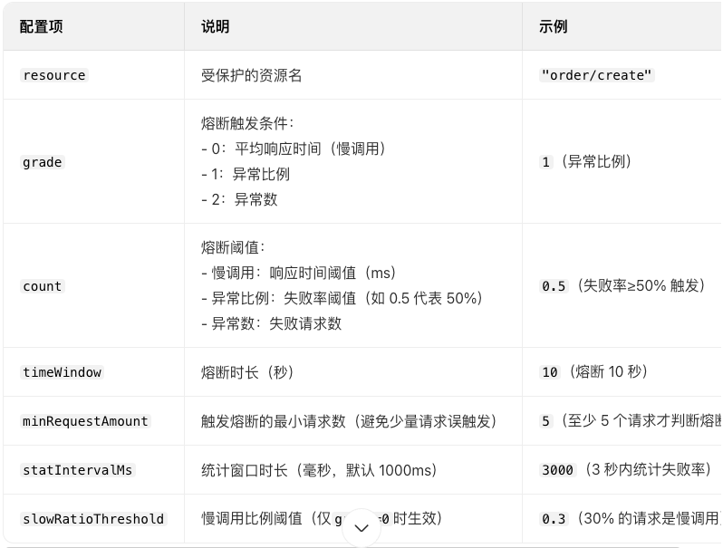

# Sentinel 是阿里巴巴开源的面向分布式服务架构的流量治理组件

## 核心模型：资源（Resource） + 规则（Rule）
Sentinel 的一切围绕 “资源” 展开：

- 资源（Resource）：代表任何需要保护的逻辑单元 
  - 如：一个 HTTP 接口 /api/order
  - 一个方法 OrderService.createOrder()
  - 一个 Dubbo 服务
- 规则（Rule）：定义如何保护该资源
  - 限流规则（FlowRule）
  - 熔断规则（DegradeRule）
  - 系统规则（SystemRule）
  ✅ 使用方式：

```java

// 方式1：注解
@SentinelResource("createOrder")
public void createOrder() { ... }

// 方式2：API 编码
try (Entry entry = SphU.entry("createOrder")) {
// 业务逻辑
} catch (BlockException e) {
// 限流/熔断处理
}
```
## 限流算法：支持多种模式
Sentinel 的 FlowRule 支持 5 种限流模式，底层使用不同算法：

| 模式（grade）| 算法               | 说明                     |
|-------------|--------------------|--------------------------|
| QPS（默认）| 滑动窗口 + 令牌桶   | 控制每秒请求数           |
| 线程数      | 信号量（计数器）| 控制并发线程数           |
| Warm Up（预热） | 令牌桶 + 预热曲线   | 冷启动时缓慢提升阈值     |
| 排队等待    | 漏桶算法（Leaky Bucket） | 超过阈值则排队，匀速通过 |
| Warm Up + 排队 | 混合模式           | 预热 + 排队              |
1. QPS 限流（最常用）
- 目标：每秒最多处理 N 个请求
- 实现：
  - 使用 滑动窗口（Sliding Window） 统计最近 1 秒内的 QPS
  - 每个窗口划分为 多个小格子（如 20 个 50ms 格子）
  - 新请求到来时，只统计 最近 1000ms 内的格子总和

2. 线程数限流
- 目标：最多 N 个线程同时执行该资源
- 实现：原子计数
- ✅ 适用场景：防止线程池耗尽（如数据库连接池瓶颈）

3. Warm Up（冷启动）
- 问题：系统刚启动时，缓存未预热、连接池未建立，直接满负荷会崩溃
- 解决方案：
  - 初始阈值 = threshold / coldFactor（默认 coldFactor=3）
  - 在 warmUpPeriodSec（如 10 秒）内，线性提升到 full threshold
  - 📈 公式：阈值(t) = threshold × (1 - e^(-kt))（实际用分段线性近似）

4. 排队等待（匀速器）
- 目标：超过阈值不拒绝，而是排队，以固定间隔放行
- 算法：漏桶（Leaky Bucket）
  - 桶容量 = maxQueueingTimeMs（最大排队时间） 
  - 出水速率 = 1000ms / threshold（如 threshold=5 → 每 200ms 放行 1 个）
- 效果：削峰填谷，请求匀速处理

## 实时指标统计：高性能无锁设计
Sentinel 的高性能关键在于 无锁滑动窗口统计：

1. MetricBucket（指标桶）
   - 每个资源维护一个环形数组（如 40 个桶）
   - 每个桶记录 500ms 内的 QPS、线程数等
   - 时间轮驱动：每 500ms 滚动到下一个桶
2. 无锁更新
   - 使用 LongAdder（JDK 8+） 替代 AtomicLong
   - 多线程写入时分散到不同 Cell，减少 CAS 冲突
   - 读取时聚合所有 Cell 值
   - 性能：单机可支撑 百万级 QPS 统计。

## 规则生效机制：动态 & 实时
1. 规则加载
   - 启动时从 FlowRuleManager.loadRules() 加载
   - 支持 动态数据源（Nacos、ZooKeeper、Apollo），实时推送新规则
2. 拦截流程
```text
   [请求进入]
   ↓
   SphU.entry("resource")
   ↓
   检查 FlowSlot（限流插槽）
   ↓
   根据规则类型（QPS/线程数）获取当前指标
   ↓
   if (当前指标 > 阈值) {
   触发 BlockException
   } else {
   放行 + 更新指标统计
   }
 ```
3. 集群限流（高级功能）
   - Sentinel 提供 Token Server 模式：
   - 所有节点向 Token Server 申请令牌

## 熔断降级规则
