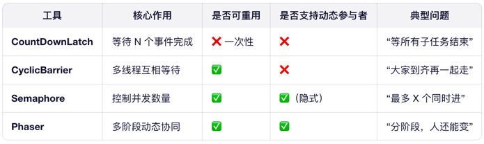

# 并发

## CountDownLatch、CyclicBarrier、Semaphore、Phaser

## ConcurrentHashMap 统计元素总数
采用「基础计数 + 分段计数」的方案：
- baseCount：基础计数器，低并发时通过 CAS 直接修改，效率高；
- CounterCell[]：分段计数器，高并发时若 CAS 修改 baseCount 失败，会创建 CounterCell 数组，将计数分散到不同的 Cell 中，避免竞争；
- size() 计算：遍历 baseCount + 所有 CounterCell 的值，求和得到总元素数

## ConcurrentHashMap 扩容

### 触发扩容的条件
当执行 put 操作时，若满足以下任一条件，会触发扩容（transfer）：

- 元素数量超过阈值（size > capacity * loadFactor）
- 某个桶的链表长度达到 8 且数组长度小于 64（先扩容，而不是转红黑树）

### 关键数据结构支持
1. sizeCtl 字段（volatile）
   控制表初始化和扩容的关键状态变量。
   含义：
   > 0：下次扩容的阈值（或初始容量） 
   > < 0：表示正在初始化（-1）或正在扩容（如 -N，N 表示扩容标记 + 并发线程数等信息）

2. nextTable 引用（volatile）
   扩容时指向新创建的哈希表（原表为 table）。
   所有线程通过读取 nextTable 判断是否处于扩容中。

3. ForwardingNode（转移节点）
   一种特殊节点，hash = -1。
   当某个桶（bin）的数据迁移完成，原 table 对应位置会被 CAS 替换为 ForwardingNode，指向 nextTable。
   其他线程访问该桶时，发现是 ForwardingNode，就知道要去新表查，或协助扩容。

### 扩容过程如何保证线程安全？
✅ 1. CAS 设置扩容状态
第一个发现需要扩容的线程通过 CAS 将 sizeCtl 从正数改为 (rs << RESIZE_STAMP_SHIFT) + 2（负值），表示开始扩容。
其他线程检测到 sizeCtl < 0，就知道已有线程在扩容，不会重复创建新表。

✅ 2. 每个线程负责一段连续的桶（分片迁移）
扩容任务被划分为多个“迁移区间”（默认每次处理 16 个桶）。
每个线程通过 CAS 抢占迁移区间（修改 transferIndex），避免重复迁移。
例如：线程 A 负责 [0~15]，线程 B 负责 [16~31]，互不干扰。

✅ 3. 对每个桶加锁迁移
在迁移某个桶的数据前，线程会对 该桶的头节点加 synchronized 锁。
防止其他线程同时修改该桶（如 put/remove）。
迁移完成后，将原桶替换为 ForwardingNode（CAS 操作）。

✅ 4. 其他线程协助扩容（helpTransfer）
当线程执行 put/get 时，若发现当前桶是 ForwardingNode（即正在扩容），会主动调用 helpTransfer() 协助迁移其他桶。
实现 “谁闲谁干活” 的负载均衡，加速扩容完成。

✅ 5. volatile 保证可见性
table、nextTable、sizeCtl 均为 volatile，确保所有线程看到最新的状态。
例如：扩容完成后，主线程将 table = nextTable，其他线程立即可见。

✅ 6. 扩容完成后的状态切换
当所有桶迁移完毕，最后一个完成任务的线程：
- 将 nextTable = null
- 更新 table 指向新数组
- 重置 sizeCtl 为新的扩容阈值（新容量 * loadFactor）

## synchronized 原理和锁升级

### Synchronized 和 ReentrantLock 有哪些不同点
- sync 是 Java 的关键字；rtl 是 JDK 提供的一个类
- sync JVM 层面的锁；rtl 是 API 层面的锁
- sync 自动加锁与释放锁；rtl 需要手动加锁与释放锁
- sync 不可获取当前线程释放上锁；rtl 可调用 isHeldByCurrentThread 方法判断当前线程是否上锁
- sync 是非公平锁；rtl 可以选择是否为公平锁
- sync 锁不可中断；rtl 可中断，设置超时时间或者调用 interrupt 方法进行中断
- sync 锁的是对象，锁信息保存在对象头中；rtl 使用一个int类型的state标识来标记锁的状态
- sync 底层有锁升级过程；rtl 没有

### 原理
synchronized是java提供的原子性内置锁，这种内置的并且使用者看不到的锁也被称为监视器锁，使用synchronized之后，会在编译之后在同步的代码块前后加上monitorenter和monitorexit字节码指令，他依赖操作系统底层互斥锁实现。他的作用主要就是实现原子性操作和解决共享变量的内存可见性问题。

执行monitorenter指令时会尝试获取对象锁，如果对象没有被锁定或者已经获得了锁，锁的计数器+1。此时其他竞争锁的线程则会进入等待队列中。

执行monitorexit指令时则会把计数器-1，当计数器值为0时，则锁释放，处于等待队列中的线程再继续竞争锁。

synchronized是排它锁，当一个线程获得锁之后，其他线程必须等待该线程释放锁后才能获得锁，而且由于Java中的线程和操作系统原生线程是一一对应的，线程被阻塞或者唤醒时时会从用户态切换到内核态，这种转换非常消耗性能。

从内存语义来说，加锁的过程会清除工作内存中的共享变量，再从主内存读取，而释放锁的过程则是将工作内存中的共享变量写回主内存。

如果再深入到源码来说，synchronized实际上有两个队列waitSet和entryList。

- 当多个线程进入同步代码块时，首先进入entryList
- 有一个线程获取到monitor锁后，就赋值给当前线程，并且计数器+1
- 如果线程调用wait方法，将释放锁，当前线程置为null，计数器-1，同时进入waitSet等待被唤醒，调用notify或者notifyAll之后又会进入entryList竞争锁
- 如果线程执行完毕，同样释放锁，计数器-1，当前线程置为null

### 锁升级
1. 无锁 → 偏向锁

当第一个线程访问同步块时，JVM 将对象头 Mark Word 中的 线程 ID 设为该线程 ID，并打上“偏向锁”标记。
后续该线程再次进入，只需比对线程 ID，无需任何同步操作。

优点：完全无同步开销（适用于单线程反复加锁场景）。

撤销条件：当有第二个线程尝试获取锁时，偏向锁被撤销，升级为轻量级锁。

2. 偏向锁 → 轻量级锁

第二个线程到来，发现锁已被其他线程偏向。
JVM 暂停拥有偏向锁的线程，检查是否还在同步块中：
- 若已退出 → 直接撤销偏向锁
- 若仍在 → 升级为轻量级锁

轻量级锁通过 CAS 将对象头 Mark Word 替换为指向线程栈中 Lock Record 的指针。

3. 轻量级锁 → 重量级锁

当多个线程 同时竞争 同一锁（自旋失败）：

轻量级锁会进行 自旋（Spin）（默认 10 次，可通过 -XX:PreBlockSpin 调整）

若自旋期间仍未获得锁 → 升级为重量级锁

重量级锁：将线程挂起（进入 _EntryList），由 OS 调度，开销大但节省 CPU。

### 其他

1. 自适应自旋： JVM 根据历史信息动态调整自旋次数（上次成功则多自旋，失败则少自旋）
2. 锁消除  
   前提：JIT 编译器通过 逃逸分析（Escape Analysis） 判断锁对象是否“逃逸”出方法或线程。  
   优化：若锁对象是局部变量且未被共享（如 new Object() 仅用于 synchronized），则直接删除锁操作。
3. 锁粗化  
   问题：循环内频繁加锁/解锁（如 for 中 synchronized）导致大量 Monitor 操作。  
   优化：JVM 将相邻的同步块合并为一个更大的同步区域，减少加锁次数。
4. 默认禁用偏向锁（JDK 15）
   现代应用多为高并发，偏向锁很少生效；  
   撤销偏向锁需 STW（安全点暂停），增加延迟抖动；  
   维护成本高，收益低。 
