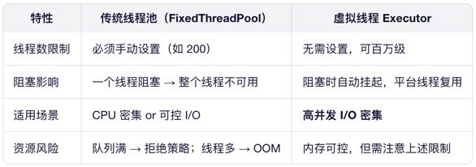
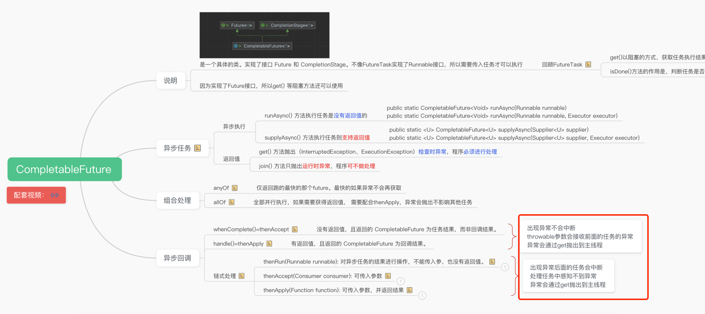
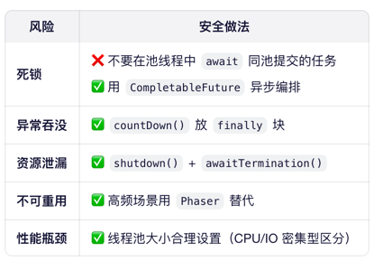

# 线程池

## 线程间通信主要有五种方式：

1. 共享变量（需 volatile 或 synchronized 保证可见性）；
2. wait()/notify()（基于对象监视器，需在同步块中使用）；
3. Lock + Condition（更灵活的显式锁等待机制）；
4. 阻塞队列（如 BlockingQueue）——这是最推荐的方式，天然线程安全且解耦；
5. JUC 工具类，如 CountDownLatch、CyclicBarrier 等，适用于特定协调场景。
> 在实际开发中，我会优先选择 阻塞队列 或 CompletableFuture，避免手写底层同步逻辑，减少出错风险

## 线程池的阻塞队列
1. ArrayBlockingQueue ，由数组结构组成的有界阻塞队列。
2. LinkedBlockingQueue ，由链表结构组成的有界阻塞队列。
3. PriorityBlockingQueue ，支持优先级排序的无界阻塞队列。
4. DelayQueue，使用优先级队列实现的无界阻塞队列。
5. SynchronousQueue，不存储元素的阻塞队列。
6. LinkedTransferQueue，由链表结构组成的无界阻塞队列。
7. LinkedBlockingDeque，由链表结构组成的双向阻塞队列。

## Executors的应用场景和注意问题
Executors 里主要有 4 种。
1. FixedThreadPool，固定线程数的 —— 核心线程数和最大线程数一样，用无界的 LinkedBlockingQueue，适合任务数量固定、需要长期跑的场景，比如后台定时处理数据，但要注意：要是任务执行慢，队列会堆很多任务，容易内存溢出；
2. CachedThreadPool，可缓存的 —— 核心线程数是 0，最大线程数是 Integer.MAX_VALUE，用的是同步队列不存元素SynchronousQueue，线程闲 60 秒就销毁，适合任务多但执行快的场景，比如处理短期请求，但要是任务执行慢，会创一大堆线程，把资源占满；
3. SingleThreadExecutor，单线程的 —— 核心和最大线程数都是 1，也是无界队列，适合要 “任务按顺序执行” 的场景，比如日志写入文件，不能并发写乱了
4. ScheduledThreadPool，定时任务用的 —— 核心线程数固定，最大是 Integer.MAX_VALUE，用的是 DelayedWorkQueue，适合定时或周期性任务，比如每天凌晨备份数据、每隔 5 分钟发一次消息。

风险点
- FixedThreadPool 和 SingleThreadExecutor，用的是无界队列，要是任务提交得比执行得快，队列会一直堆任务，最后 OOM；
- CachedThreadPool 和 ScheduledThreadPool，最大线程数是 Integer.MAX_VALUE，要是任务执行慢，会创成千上万的线程，CPU 和内存直接就扛不住了。
所以实际项目里，一般不建议直接用 Executors 创建线程池，而是自己用 ThreadPoolExecutor 手动创建 —— 这样能自己设有界队列、合理的最大线程数，避免这些风险

## 美团动态线程池+状态监控
- 动态调整线程数，所有线程自动注册到管理中心web（mq,@Async），指标采集监控告警
1. 基于ThreadPoolExecutor自带方法（基础监控）
   通过ThreadPoolExecutor提供的原生 API，可获取线程池的关键状态数据，常用方法及作用：
   getCorePoolSize()：获取线程池的核心线程数（配置的常驻线程数）
   getPoolSize()：获取当前线程池的总线程数（包含核心线程 + 临时线程）
   getActiveCount()：获取当前正在执行任务的线程数
   getQueue().size()：通过任务队列获取待执行的任务数量
   getCompletedTaskCount()：获取线程池已完成的任务总数
2. 自定义 / 第三方工具监控（进阶监控）
   通过日志记录或专业工具，实现线程池的实时、可视化监控：
   自定义监控：在任务执行前后记录日志（如任务开始 / 结束时间、线程 ID 等），追踪任务执行情况；
   第三方工具：借助Spring Boot Admin（Spring 生态的应用监控工具）、Prometheus（时序监控系统）等，可实时观测线程池的任务堆积、线程数异常等状态，便于及时调整线程池参数（如核心线程数、队列容量）。


## 线程池有哪些状态
线程池有5种状态，
1. RUNNING，指的是线程池的初始化状态，可添加待执行的任务。 
2. SHUTDOWN，指的是线程池处于待关闭状态，不接收新任务，仅处理已接收的任务。 
3. STOP，指的是线程池立即关闭，不接收新的任务，放弃缓存队列中的任务并且中断正在处理的任务。 
4. TIDYING，指的是线程池自主整理状态，我们可以调用 terminated() 方法进行线程池整理。 
5. TERMINATED，指的是线程池终止状态。

## 线程池怎么实现复用
线程池将线程和任务进行解耦，线程是线程，任务是任务，摆脱了之前通过 Thread 创建线程时的一个线程必须对应一个任务的限制。
在线程池中，同一个线程可以从阻塞队列中不断获取新任务来执行，其核心原理在于线程池对
Thread 进行了封装，并不是每次执行任务都会调用 Thread.start() 来创建新线程，而是让每个线程去执行一个“循环任务”，在这个“循环任务”中不停检查是否有任务需要被执行，如果有则直接执行，也就是调用任务中的 run 方法，将 run 方法当成一个普通的方法执行，通过这种方式只使用固定的线程就将所有任务的 run 方法串联起来

## 创建线程池以及销毁


原生销毁线程池
✅ Spring Boot 示例：

```java

@Component
public class AsyncConfig {
private final ExecutorService executor = Executors.newFixedThreadPool(10);

    @PreDestroy
    public void shutdown() {
        executor.shutdown();
        try {
            if (!executor.awaitTermination(30, TimeUnit.SECONDS)) {
                executor.shutdownNow();
            }
        } catch (InterruptedException e) {
            executor.shutdownNow();
            Thread.currentThread().interrupt();
        }
    }

    public ExecutorService getExecutor() { return executor; }
}
```

## 虚拟线程池 jdk21
JVM 内部使用一个固定大小的平台线程池（Carrier Thread Pool） 来运行所有虚拟线程（默认是 ForkJoinPool.commonPool()，大小 ≈ CPU 核数）
```java
// ✅ 推荐：每个任务一个虚拟线程（无需配置大小！）
try (var executor = Executors.newVirtualThreadPerTaskExecutor()) {
for (int i = 0; i < 1_000_000; i++) {
executor.submit(() -> {
// 模拟 I/O 操作（HTTP、DB、文件等）
String result = httpClient.get("/api/data");
process(result);
return result;
});
}
} // 自动 awaitTermination，等待所有任务完成
```


## CompletableFuture 使用


---

1. 永远不要依赖默认线程池（ForkJoinPool.commonPool）默认线程数 = CPU 核数 - 1，且全局共享，IO 密集型任务会阻塞整个池。
```Java
ExecutorService ioPool = Executors.newFixedThreadPool(20,
        r -> new Thread(r, "order-async-pool-" + counter++));

        CompletableFuture.supplyAsync(this::callPayment, ioPool);
```
2. 必须处理异常，否则会静默失败
   CompletableFuture 中的异常不会自动抛出，若不处理，任务会“悄无声息”地失败。

✅ 正确做法：使用 handle 或 whenComplete 捕获异常：

```java

f.exceptionally(ex -> {
log.error("Async task failed", ex);
return null;
});

// 或统一处理
f.whenComplete((result, ex) -> {
if (ex != null) {
log.error("Task error", ex);
}
});
```
⚠️ 注意：thenApply 等中间操作中的异常也会被封装，需在链尾处理。

3. 避免在回调中阻塞（如调用 .get()）
   在 thenApply、thenAccept 等回调中调用 .get() 会导致 线程阻塞，尤其当回调在 commonPool 中执行时，可能造成 线程饥饿。

❌ 危险代码：

```java
CompletableFuture<String> f1 = asyncCall1();
CompletableFuture<String> f2 = f1.thenApply(result -> {
// 在异步线程中同步等待另一个 future！
return anotherFuture.get(); // 阻塞！
});
```
✅ 正确做法：用 组合操作 替代阻塞：

```java

CompletableFuture<String> f2 = f1.thenCompose(result -> anotherFuture);
// 或
CompletableFuture.allOf(f1, f2).thenRun(...);
```
📌 原则：异步链中永远不要出现 .get()、.join()（除非在最终结果处）


5. 资源管理：及时关闭自定义线程池
   如果你创建了自定义 ExecutorService，必须在应用关闭时优雅 shutdown，否则：
线程不会退出，导致 JVM 无法正常终止
可能造成内存泄漏


## Async 注解


### 常见陷阱与解决方案

| 陷阱 | 现象 | 风险 | 解决方案 |
|------|------|------|---------|
| **使用默认线程池** | 每次调用新建线程 | 线程爆炸 → OOM / 系统卡死 | **必须自定义 `ThreadPoolTaskExecutor`** |
| **同对象内调用 `@Async`** | 方法同步执行，未异步 | 逻辑错误，性能未提升 | 1. 注入自身（`@Autowired private Self self`）<br>2. 拆分到另一个 `@Service` |
| **事务失效** | `@Transactional` 不生效 | 数据不一致 | 异步方法内显式调用带事务的 Service；或避免在异步中操作关键数据 |
| **异常静默丢失** | 无日志、无报警 | 故障无法发现 | 1. 返回 `CompletableFuture` 并处理异常<br>2. 配置 `AsyncUncaughtExceptionHandler` |
| **上下文丢失** | MDC traceId、SecurityContext 为空 | 日志链路断裂、权限错误 | 使用 `TaskDecorator` 传递 `ThreadLocal` 上下文 |
| **JVM 无法正常退出** | 应用停机后进程仍在 | 运维困难 | 设置 `waitForTasksToCompleteOnShutdown=true`，或手动 `@PreDestroy` shutdown |
| **线程池无监控** | 无法感知队列积压、拒绝 | 故障滞后发现 | 暴露 `ThreadPoolTaskExecutor` 指标到 Micrometer / Prometheus |


### 最佳实践 Checklist

- ✅ **启用 `@EnableAsync`** 并配置自定义线程池
- ✅ **线程池使用有界队列**（避免内存溢出）
- ✅ **为不同业务创建独立线程池**（如 `orderAsyncExecutor`, `notifyAsyncExecutor`），实现故障隔离
- ✅ **返回 `CompletableFuture<T>` 而非 `void`**，便于组合、超时、异常处理
- ✅ **通过 `TaskDecorator` 传递 MDC / SecurityContext**
- ✅ **配置全局异步异常处理器**（`AsyncConfigurerSupport`）
- ✅ **避免在 `@Async` 方法中调用 `this.xxx()`**（代理失效）
- ✅ **不要在异步方法中启动新 `@Async`**（可能导致线程池嵌套耗尽）
- ✅ **对关键异步任务添加超时控制**：


## TransmittableThreadLocal原理
TransmittableThreadLocal（TTL）是阿里开源的一个增强版 ThreadLocal，主要用于解决 线程池等异步场景下上下文无法传递 的问题。
它的核心原理是 ‘Capture-Transmit-Restore’ 三步机制：
Capture（捕获）：在任务提交时（父线程），自动抓取当前所有 TTL 变量的值，形成一个上下文快照；
Transmit（传递）：将这个快照封装进一个装饰后的任务对象（如 TtlRunnable）中；
Restore（还原与清理）：当线程池中的子线程执行任务时，先将快照还原到子线程的 ThreadLocal，任务结束后再自动清理或恢复原状态，避免内存泄漏和脏数据。
为了实现这一点，TTL 内部维护了一个静态的 holder（本质是 ThreadLocalMap），用来注册所有活跃的 TTL 实例，从而能统一 capture 和 replay。
同时，通过 TtlExecutors 装饰线程池，可以做到对业务代码零侵入，广泛应用于日志链路追踪（如 TraceID 透传）、用户上下文传递等场景。

相比 JDK 自带的 InheritableThreadLocal，TTL 的最大优势是 支持线程池复用场景，而 InheritableThreadLocal 只在新线程创建时继承一次，无法用于线程池


## 共享线程池 + CountDownLatch 的 正确使用姿势



