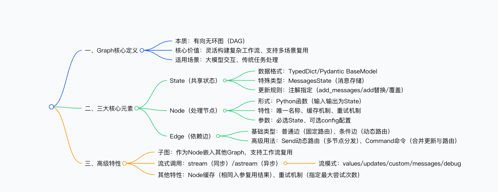
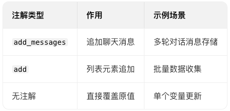
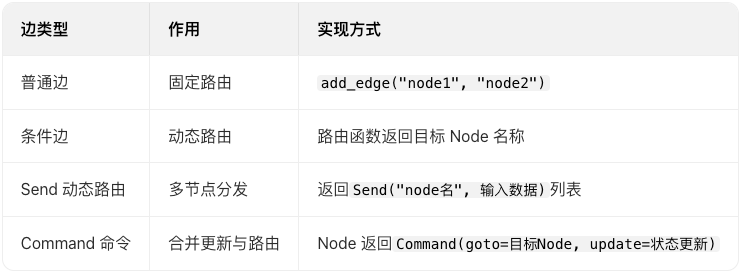
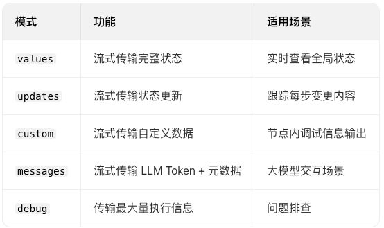

# LangGraph 核心

> LangGraph 的核心是有向无环图（DAG） 结构，通过State（共享状态）、Node（处理节点）、Edge（依赖边） 三大核心元素串联任务流程，支持子图复用、流式调用、缓存与重试等产品级特性，可灵活构建复杂工作流，既适配大模型交互场景，也可用于传统任务处理，其核心优势在于状态共享与流程动态调度的灵活性。





## 一、Graph 核心概述
1. 本质：LangGraph 的核心组件，采用有向无环图（DAG） 结构，用于描述任务间依赖关系
2. 核心目标：串联多个处理单元（Node），实现复杂工作流的灵活调度
4. 适用范围：既支持大模型交互场景（如对话消息管理），也可处理传统数据处理任务
## 二、三大核心元素详解
### 1. State（共享状态）
- 定义：所有 Node 共享的数据结构，存储流程中关键数据
- 支持格式
- 基础格式：TypedDict（推荐）、Pydantic BaseModel
- 消息专用格式：MessagesState（简化聊天消息存储）
- 声明示例
```python

class State(TypedDict):
messages: Annotated[list[AnyMessage], add_messages]  # 消息追加
list_field: Annotated[list[int], add]  # 列表追加
extra_field: int  # 直接覆盖
```
- 更新规则（通过注解指定）


- 消息序列化支持：两种声明方式等效
  - 标准格式：{"messages": [HumanMessage(content="message")]}
  - 简化格式：{"messages": [{"type": "user", "content": "message"}]}

### 2. Node（处理节点）
- 核心形式：Python 函数，输入为 State 对象，输出为更新后的 State 对象
- 关键属性
   - 名称：唯一字符串，未指定时默认与函数名一致
   - 缓存机制：相同入参时复用结果，可通过CachePolicy设置缓存时长（如 TTL=5 秒）
   - 重试机制：支持单个节点指定RetryPolicy(max_attempts=4)，或任务级指定递归限制（如recursion_limit=25）
- 参数结构
   - 必选参数：State（共享状态数据）
   - 可选参数：config（运行配置，如{"configurable": {"user_id": "123"}}）
### 3. Edge（依赖边）
- 核心作用：定义 Node 间的执行顺序与路由规则
- 类型分类

- 特殊节点：默认START（入口）、END（出口），支持自定义入口点（set_entry_point）


## 三、高级特性
### 1. 子图（SubGraph）
- 定义：将一个 Graph 作为 Node 嵌入另一个 Graph，实现工作流复用
- 执行逻辑：触发子图 Node 时，等效调用subgraph.invoke(state)
- 注意事项：主图与子图若使用相同 State，会导致状态重复更新（如消息重复追加）
### 2. 流式调用
- 核心方法：同步stream()、异步astream()
- 流模式分类（5 种）

   自定义流实现：通过get_stream_writer().write(自定义数据)实现节点内自定义输出
3. 其他关键特性
- 缓存机制：基于InMemoryCache实现，默认缓存相同入参的 Node 执行结果
- 重试机制：支持节点级（retry=RetryPolicy）和任务级（config={"recursion_limit":25}）配置
- 兼容性：支持关闭 LLM 流式输出（disable_streaming=True）

## 关键问题
1. 问题：LangGraph 中 State 的更新规则由什么决定？不同更新规则适用于哪些场景？

答案：State 的更新规则由属性注解指定，共 3 种核心规则：① add_messages：适用于聊天消息追加场景，新消息会添加到原有列表；② add：适用于普通列表数据收集（如批量数值汇总）；③ 无注解：适用于单个变量更新，新值直接覆盖原值。注解让状态更新更灵活，适配不同数据存储需求。
2. 问题：Node 的缓存与重试机制如何配置？核心作用是什么？

答案：① 缓存配置：通过add_node时指定cache_policy=CachePolicy(ttl=5)（缓存 5 秒），需配合compile(cache=InMemoryCache())启用，核心作用是相同入参时复用结果，减少重复计算，提升执行速度；② 重试配置：节点级通过retry=RetryPolicy(max_attempts=4)（最大尝试 4 次），任务级通过invoke的config={"recursion_limit":25}，核心作用是提升节点执行的容错性，应对临时故障。
3. 问题：Edge 的动态路由有哪些实现方式？分别适用于什么场景？

答案：动态路由主要有 3 种实现方式：① 条件边：通过路由函数返回单个 Node 名称，适用于二选一 / 多选一路由（如根据状态值决定下一个处理节点）；② Send 动态路由：返回多个Send对象，适用于批量数据分发（如将列表中每个元素分别传入同一个 Node 处理）；③ Command 命令：Node 内返回Command对象，合并状态更新与路由逻辑，适用于一步完成状态修改与下一步指定的场景，简化流程配置。