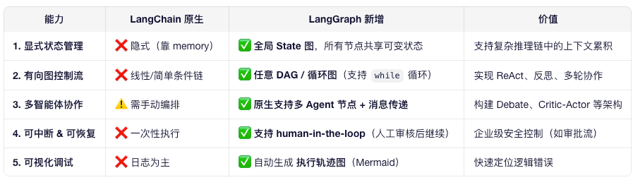
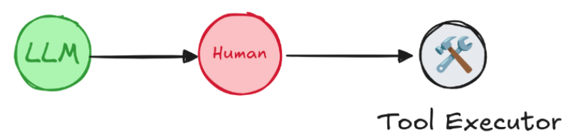
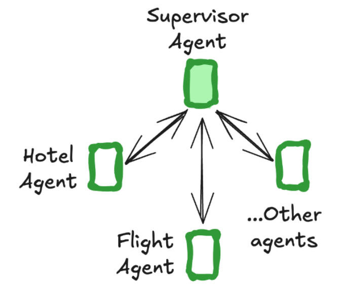

# LangGraph 在 LangChain 之上提供了什么能力
> 可解释性+可控性+灵活编排
## LangGraph 是什么 
LangGraph的官⽹地址：https://docs.langchain.com/oss/python/langgraph/overview
> LangGraph 是 LangChain 的官方扩展库，用于构建 状态化、多智能体（multi-agent）、循环可控的 LLM 应用，特别适合实现 复杂工作流（如 ReAct、Plan-and-Execute、Agent 协作）。



## 更简单的封装

```python
from langgraph.prebuilt import create_react_agent

agent = create_react_agent(
    model=llm,
    tools=[get_current_date],
    prompt="You are a helpful assistant",
)

agent.invoke({"messages":[{"role":"user","content":"今天是几月几号"}]})
```

## State+Nodes+Edges灵活编排可解释性
```python
from langgraph.graph import StateGraph, END

# 1. 定义全局状态
class AgentState(TypedDict):
    messages: Annotated[list, add_messages]  # 自动合并消息
    current_plan: str

# 2. 定义节点（函数）
def planner(state: AgentState):
    return {"current_plan": llm.invoke("制定计划...")}

def executor(state: AgentState):
    result = llm.invoke(f"执行: {state['current_plan']}")
    return {"messages": [result]}

# 3. 构建图
workflow = StateGraph(AgentState)
workflow.add_node("planner", planner)
workflow.add_node("executor", executor)
workflow.set_entry_point("planner")
workflow.add_edge("planner", "executor")
workflow.add_edge("executor", END)

# 4. 编译并运行
app = workflow.compile()
result = app.invoke({"messages": ["帮我订机票"]})
```

## 子图嵌套-模块化设计复用复杂逻辑
- 说明：
可将一个图作为另一个图的 子节点（subgraph）；
支持嵌套调用，降低复杂度；
类似函数调用，但支持状态传递。
- 实际场景：
“写作助手”是一个大图，其中包含“头脑风暴”、“大纲生成”、“润色”等子图；
每个子图独立开发、测试、部署。
```python
writing_workflow = StateGraph(State)
writing_workflow.add_node("brainstorm", brainstorm)
writing_workflow.add_node("outline", outline)
writing_workflow.add_edge("brainstorm", "outline")

# 在主图中调用
main_graph.add_node("write_story", writing_workflow.compile())
```

## Interrupts 实现 Human-in-the-loop ⼈类监督
在Agent的⼯作过程中，有⼀个问题是⾮常致命的。就是Agent可以添加Tools⼯具，但是要不要调⽤⼯具，却完全
是由Agent⾃⼰决定的。
这就会导致Agent在⾯对⼀些问题时，可能会出现错误的判断。
为了解决这个问题，LangGraph提供了Human-in-the-loop的功能。在Agent进⾏⼯具调⽤的过程中，允许⽤户进
⾏监督。这就需要中断当前的执⾏任务，等待⽤户输⼊后，再重新恢复任务

- 说明：
图执行过程中，可被外部信号（如用户输入、定时器）中断；
中断后可跳转到其他节点（如人工审核、错误处理）；
是实现 Human-in-the-loop 的关键。

- 实际场景：
用户中途说：“不要写这个了，改写成诗歌” → 系统中断当前流程，切换到新任务；
系统检测到敏感词 → 中断并触发安全审查节点。

```python
def should_interrupt(state):
    return "interrupt" in state.get("messages", [])

workflow.add_conditional_edges(
    "agent",
    should_interrupt,
    {
        True: "human_review",
        False: "continue"
    }
)
```

## 多 Agent 应⽤构建
通常我们希望⼀个Agent能够专注⼲好⼀件事情。但是，如果是⾯对⼀些复杂的任务，我们可能需要多个Agent协
同完成。例如⼀种典型的多Agent系统会是这样的

由⼀个Supervisor Agent对任务进⾏分发。然后，交由另⼀个Agent来处理具体的事情。这样，这多个Agent就可
以成为⼀个同时处理多个任务的系统。
LangGraph中单独提供个⼀个langgraph-supervisor依赖库来实现这种类型的多Agent系统。
LangGraph的核⼼是⽤Graph图的⽅式来实现多Agent协作。所以，这个库更多是作为基础了解。


## Memory 优化自动管理上下文，避免手动维护对话历史

- 说明：
提供 Annotated[list, add_messages] 等特殊类型，自动合并消息；
所有节点共享全局状态中的 messages 字段；
避免重复传递 context。
- 实际场景：
多轮对话中，无需每次传入全部历史；
Agent 之间协作时，自动继承上下文。

```python

class State(TypedDict):
messages: Annotated[list, add_messages]  # 自动追加消息

def agent(state: State):
return {"messages": [llm.invoke("回复...")]}

# 不需要手动拼接 history！
```