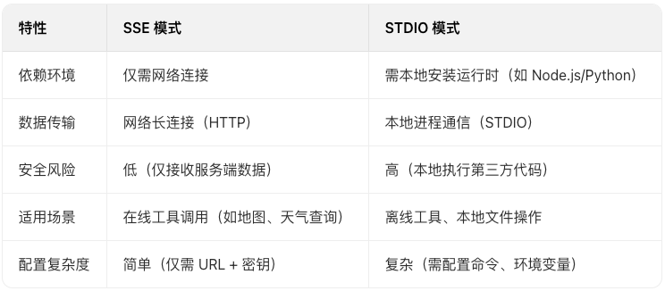

# LangGraph 接入 MCP

## 一、核心定位与核心价值
### 1. 本质定义
MCP并非全新技术，而是基于大模型原生Function Call能力的**应用层协议**。它不包含具体工具实现，仅规范了“应用程序向大模型提供工具调用”的统一接口，解决了不同工具调用方式碎片化的问题，提升工具复用性。

### 2. 核心价值
- **低门槛集成**：无需开发复杂适配代码，通过简单JSON配置即可让大模型接入各类外部服务（如地图、邮件、文件操作等）。
- **工具生态化**：聚合了数千个第三方服务（如高德地图、阿里云百炼等），形成标准化工具市场，支持快速扩展大模型能力边界。
- **跨平台兼容**：适配Claude、文心一言、通义千问等主流大模型，支持VSCode（Cline插件）、LangGraph等多种开发环境。

### 3. 与传统Function Call的区别
| 特性 | MCP协议 | 传统Function Call |
| :--- | :--- | :--- |
| 调用方式 | 标准化配置（JSON文件） | 代码层面绑定工具（如`bind_tools`） |
| 工具复用性 | 高（跨平台、跨模型通用） | 低（需针对不同框架/模型重复开发） |
| 接入成本 | 极低（无需关注底层实现） | 较高（需手动定义工具、处理调用逻辑） |
| 生态支持 | 丰富的第三方工具市场（如mcp.so） | 需自行寻找/开发工具 |

## 二、核心工作机制
MCP的交互流程围绕“客户端-大模型-MCP服务端”三方展开，本质是标准化的函数调用流程：
1. **工具注册**：MCP服务端（如高德地图）暴露工具接口（如路线规划），并遵循MCP协议规范定义调用参数。
2. **客户端配置**：开发者通过JSON文件配置MCP服务地址、API密钥等信息（如高德地图的SSE服务URL）。
3. **用户提问**：用户向大模型发起需要工具支持的请求（如“规划长沙到桂林的自驾路线”）。
4. **工具调用决策**：大模型判断需调用外部工具，通过MCP客户端向指定MCP服务端发送调用请求。
5. **结果返回与整合**：MCP服务端执行工具逻辑（如调用高德地图API计算路线），返回结果给大模型；大模型整合结果后向用户输出最终答案。

### 关键依赖
- **客户端工具**：如VSCode的Cline插件、LangGraph的`langchain-mcp-adapters`模块，负责封装MCP协议的底层通信逻辑。
- **服务端实现**：第三方服务商（如高德、阿里云）按MCP规范提供工具接口，支持SSE或STDIO两种传输模式。

## 三、两种核心实现模式（SSE vs STDIO）
MCP协议支持两种传输模式，适配不同部署场景，核心差异在于数据传输方式和执行环境：

### 1. SSE模式（Server-Sent Events）
#### 核心定义
基于HTTP协议的单向长连接模式，服务端主动向客户端推送数据，是最常用的MCP实现方式。

#### 工作原理
- 客户端与MCP服务端建立HTTP长连接（如高德地图的`https://mcp.amap.com/sse`）。
- 大模型需要工具支持时，通过客户端向服务端发送请求参数（如起点/终点经纬度）。
- 服务端执行逻辑后，通过长连接持续返回结果（如分步路线信息），无需重复建立连接。

#### 配置示例（高德地图）
```json
"mcpServers": {
  "amap-amap-sse": {
    "url": "https://mcp.amap.com/sse?key=你的高德API密钥"
  }
}
```

### 2. STDIO 模式
#### 核心定义
通过本地命令行执行应用程序，实现客户端与工具的通信，本质是 “本地进程调用” 模式。

#### 工作原理
- 客户端需本地安装依赖（如 Node.js、Python 环境）。
- 通过配置command和args，在本地启动 MCP 服务对应的应用程序（如高德地图的 Node.js 包@amap/amap-maps-mcp-server）。
- 工具逻辑在本地进程中执行，通过标准输入输出（STDIO）与客户端交互数据。

#### 配置示例（高德地图）
```json
"amap-maps": {
"command": "npx",
"args": ["-y", "@amap/amap-maps-mcp-server"],
"env": {
"AMAP_MAPS_API_KEY": "你的高德API密钥"
},
"transport": "stdio"
}
```




## 四、LangGraph 接入 MCP 服务实操
LangGraph 通过langchain-mcp-adapters模块支持 MCP 集成，核心步骤包括依赖安装、配置 MCP 服务、创建 Agent 并调用工具：

### 1. 环境准备
   安装依赖
```bash
   pip install langchain-mcp-adapters  # MCP适配模块
   pip install langgraph langchain-community  # LangGraph核心依赖
   pip install mcp>=1.7  # MCP协议基础库
```
### 2. 接入步骤
1. 配置 MCP 服务
   以高德地图 SSE 服务为例，创建 MCP 客户端配置：
```python
   from langchain_mcp_adapters.client import MultiServerMCPClient
   from langchain_community.chat_models import ChatTongyi
   from config.load_key import load_key


# 1. 初始化大模型（阿里云百炼qwen-plus）
llm = ChatTongyi(
model="qwen-plus",
api_key=load_key("BAILIAN_API_KEY"),  # 从配置文件加载API密钥
)

# 2. 配置MCP服务（高德地图SSE模式）
client = MultiServerMCPClient({
"amap-amap-sse": {
"url": "https://mcp.amap.com/sse?key=你的高德API密钥",
"transport": "streamable_http"  # 指定SSE传输方式
}
})
```
2. 加载工具并创建 Agent
```python
from langgraph.prebuilt import create_react_agent

# 3. 从MCP服务加载工具（如路线规划工具maps_direction_driving）
tools = await client.get_tools()

# 4. 创建React Agent（自动处理工具调用逻辑）
agent = create_react_agent(
model=llm,
tools=tools
)
```
3. 调用 Agent 执行任务
```python

# 5. 发起路线规划请求
response = await agent.ainvoke({
"messages": [{"role": "user", "content": "帮我规划一条从长沙梅溪湖到溁湾镇的自驾路线"}]
})

print(response)

```


## 五、手动开发 MCP 服务（Python 实现）
MCP 官网提供多语言 SDK（Python/TypeScript/Java 等），可快速开发自定义 MCP 服务，支持 SSE 和 STDIO 两种模式：
### 1. 开发前提
   安装 MCP 基础依赖：pip install mcp
   了解核心注解：@mcp.tool()（声明工具函数）、@mcp.resource()（声明资源接口）。
### 2. SSE 模式服务端实现
```python

from mcp.server.fastmcp import FastMCP

# 1. 初始化MCP服务（服务名称为"roymcpdemo"）
mcp = FastMCP("roymcpdemo")

# 2. 声明工具1：两数相加
@mcp.tool()
def add(a: int, b: int) -> int:
"""Add two numbers together."""
print(f"调用加法工具：add({a}, {b})")
return a + b

# 3. 声明工具2：查询城市天气
@mcp.tool()
def weather(city: str) -> str:
"""获取某个城市的天气"""
return f"城市{city}，今天天气晴朗，气温25℃"

# 4. 声明资源接口（可选）
@mcp.resource("greeting://{name}")
def greeting(name: str) -> str:
"""根据姓名打招呼"""
return f"Hello, {name}！"

# 5. 以SSE模式启动服务（默认端口8000）
if __name__ == "__main__":
mcp.run(transport="sse")
```