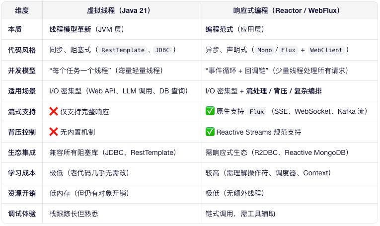

# Java 21 虚拟线程原理 & 与响应式编程对比

## 一、虚拟线程（Virtual Threads）核心原理

### 1. 核心思想
> **用少量 OS 线程（Carrier Threads）调度海量轻量级 Java 线程（Virtual Threads）**，实现高并发 I/O 而无需复杂异步代码。

### 2. 关键机制
- **轻量创建**：每个虚拟线程仅占用 ~1KB 堆内存（传统线程栈默认 1MB）
- **Continuation 挂起/恢复**：
    - 当虚拟线程执行阻塞操作（如 `socket.read()`、`Thread.sleep()`）时，
    - JVM 自动捕获当前执行状态（Continuation），
    - **挂起虚拟线程**，**释放 Carrier Thread** 去执行其他任务，
    - I/O 完成后，调度器自动恢复执行。
- **自动非阻塞化**：JDK 阻塞 API（如 Socket、InputStream）在虚拟线程中自动变为非阻塞。
- **由 JVM 调度**：调度发生在用户态，无 OS 上下文切换开销。

### 3. 使用方式（Java 21）
```java
// 显式创建
Thread.ofVirtual().start(() -> { /* 业务逻辑 */ });

// 推荐：虚拟线程池
try (var executor = Executors.newVirtualThreadPerTaskExecutor()) {
    executor.submit(() -> process());
}
```

## 二、虚拟线程 vs 响应式编程（Reactor/WebFlux）



## 三、能否替代？—— 关键结论
### ✅ 可替代场景（推荐用虚拟线程）
- 简单 REST API（返回完整 JSON）
- 调用外部 HTTP 服务（LLM、Embedding API）
- JDBC 数据库查询
> 优势：代码简单，团队上手快，吞吐量媲美响应式
### ❌ 不可替代场景（仍需响应式）
- 流式输出（LLM token-by-token、SSE、日志推送）
- 背压敏感系统（防止生产者压垮消费者）
- 复杂异步编排（zip、merge、retryWhen 等）
- 已使用响应式生态（R2DBC、Reactive Kafka）

## 四、总结
“虚拟线程不是响应式编程的替代品，而是让同步代码获得异步性能的基础设施。”
“它解决了高并发 I/O 的资源瓶颈，但没解决流处理和声明式组合的问题。”
“80% 的 CRUD 场景可用虚拟线程简化架构，20% 的流式/事件场景仍需响应式。”
“未来趋势：简单用虚拟线程，复杂用响应式，二者共存互补。”
