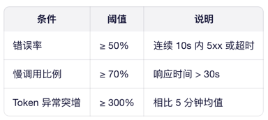
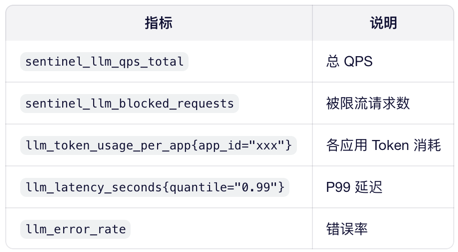

# 大模型 API 限流熔断

## 限流策略：三层分层设计
### 第一层：全局系统级限流（防雪崩）
目标：保护后端 LLM 服务不被压垮
规则：
QPS ≤ 1000（根据 GPU 资源动态调整）
并发请求数 ≤ 200
Sentinel 配置：
```java

// 系统规则
List<SystemRule> rules = new ArrayList<>();
SystemRule rule = new SystemRule();
rule.setQps(1000);
rule.setMaxThread(200);
rules.add(rule);
SystemRuleManager.loadRules(rules);
```
### 第二层：租户/应用级限流（公平性）
目标：防止单个客户耗尽资源
维度：app_id（或 tenant_id）
规则：
- 免费用户：5 QPS
- 付费用户：50 QPS
- VIP 客户：200 QPS

Sentinel 实现：
```java
// 基于 app_id 的流控
FlowRule rule = new FlowRule("llm_api")
.setResourceMode(RuleConstant.RESOURCE_MODE_DEFAULT)
.setGrade(RuleConstant.FLOW_GRADE_QPS)
.setCount(getQpsByAppId(appId)) // 动态获取配额
.setLimitApp(appId); // 关键：按 app_id 限流
```
### 第三层：模型/Token 级限流（成本控制）
目标：控制昂贵模型（如 GPT-4o）的使用
维度：model_name + max_tokens

规则：
- gpt-4o：总 Token/分钟 ≤ 10,000
- qwen-max：总 Token/分钟 ≤ 500,000

实现方式：
自定义 Slot Chain，在 StatisticSlot 后插入 TokenCountSlot
将 prompt_tokens + completion_tokens 作为统计指标
```java
// 自定义 Token 统计
public class TokenCountSlot extends AbstractLinkedProcessorSlot<DefaultNode> {
@Override
public void entry(Context context, ResourceWrapper resource, ...) {
int tokens = extractTokensFromRequest(context);
// 上报到 Sentinel Metric
ClusterBuilderSlot.getClusterNode(resource.getName())
.addTokenCount(tokens);
}
}
```

## 熔断策略
触发条件（任一满足即熔断）：

熔断行为：
- 半开状态：熔断 30s 后，放行 1 个请求试探
- 快速失败：返回 429 Too Many Requests + 友好提示
```json

{ "error": "Service temporarily unavailable due to high load. Please retry later." }
```
Sentinel 配置：
```java
编辑
DegradeRule rule = new DegradeRule("llm_api")
.setGrade(RuleConstant.DEGRADE_GRADE_RT) // 按 RT 熔断
.setCount(30_000) // 30s
.setTimeWindow(30) // 熔断时长
.setMinRequestAmount(10) // 最小请求数
.setSlowRatioThreshold(0.7); // 慢调用比例
```
## 指标监控体系
1. 核心监控指标（Prometheus）

2. Grafana 看板
   - 实时展示：各模型负载、Top 10 高频用户、Token 成本趋势
   - 告警规则：当 blocked_requests > 100/min 时触发企业微信通知

## LLM 动态限流策略（AI-Driven Tuning）
   核心思想：用 LLM 分析监控数据，自动调整限流规则
   - 步骤 1：数据采集
   每 5 分钟聚合一次指标： 
```json

   {
   "timestamp": "2025-12-22T21:00:00Z",
   "metrics": {
   "qps": 850,
   "token_usage": 1200000,
   "error_rate": 0.45,
   "top_apps": ["app_a", "app_b"]
   }
   }
```
   - 步骤 2：LLM 分析（Prompt 工程）
```text

   你是一个智能流量调度专家。根据以下系统指标，生成 Sentinel 限流规则调整建议：

当前指标：
- QPS: 850/1000
- Token 使用: 1,200,000/1,000,000（超限！）
- 错误率: 45%
- 高负载应用: app_a (占 60% Token)

请输出 JSON 格式建议：
{
"adjust_global_qps": false,
"adjust_app_rules": [
{"app_id": "app_a", "new_qps": 30}
],
"trigger_circuit_breaker": true,
"reason": "..."
}
```
- 步骤 3：自动执行
LLM 返回 JSON → 解析 → 调用 Sentinel 动态规则 API
```java

// 动态更新应用级规则
FlowRule newRule = new FlowRule("llm_api")
.setCount(30)
.setLimitApp("app_a");
FlowRuleManager.loadRules(Collections.singletonList(newRule));
```
- 步骤 4：反馈闭环
记录调整效果（如 5 分钟后错误率是否下降）
用于微调 LLM Prompt 或切换更小模型（如用 Qwen-Max 替代 GPT-4o 做分析）