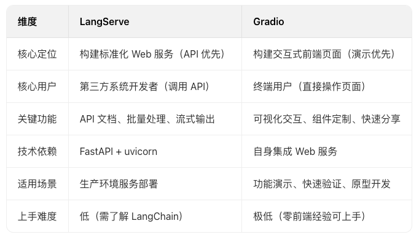

# 轻量级 Web 服务部署

> 一是使用LangServe框架将 LangChain 的 Chain 快速封装为标准化 Web 服务，支持 API 调用、可视化调试等功能；二是使用Gradio库零代码 / 低代码构建交互式前端页面，无需前端开发经验即可实现大模型功能可视化，两种方式均主打简单易上手，可快速衔接 LangChain 构建的大模型应用并对外提供服务。


## 方式一：使用 LangServe 构建大模型 Web 服务
LangServe 是专门用于部署 LangChain 应用的框架，可快速将 Chain 封装为 Web 服务，支持 API 调用、批量处理、流式输出等功能，底层依赖 FastAPI 和 uvicorn。
1. 部署步骤

（1）安装依赖
```bash

# 安装服务端+客户端整合依赖（推荐）
pip install "langserve[all]"
# 单独安装服务端：pip install "langserve[server]"
# 单独安装客户端：pip install "langserve[client]"
```
（2）构建 LangChain Chain（以翻译功能为例）
```python

from langchain_core.output_parsers import StrOutputParser
from langchain_core.prompts import ChatPromptTemplate
from langchain_openai import ChatOpenAI
from config.load_key import load_key

# 1. 定义提示词模板
prompt_template = ChatPromptTemplate.from_messages([
("system", "Translate the following from English into {language}"),
("user", "{text}")
])

# 2. 初始化大模型
llm = ChatOpenAI(
model="qwen-plus",
base_url="https://dashscope.aliyuncs.com/compatible-mode/v1",
openai_api_key=load_key("BAILIAN_API_KEY"),
)

# 3. 结果解析器（将AIMessage转为字符串）
parser = StrOutputParser()

# 4. 构建Chain
chain = prompt_template | llm | parser
```

（3）构建并启动 Web 服务
```python

from fastapi import FastAPI
from langserve import add_routes
import uvicorn

# 1. 创建FastAPI应用实例
app = FastAPI(
title="大模型语言翻译助手",
version="v1.0",
description="基于LangChain框架构建的大模型语言翻译助手"
)

# 2. 添加路由（绑定Chain到指定路径）
add_routes(
app,
chain,
path="/langchainDemo"  # 接口路径
)

# 3. 启动服务（host=0.0.0.0支持外部访问，端口8000）
uvicorn.run(app, host="0.0.0.0", port=8000)
```

## 方式二：使用 Gradio 快速构建交互式前端页面
Gradio 是 Hugging Face 开源的低代码前端构建库，无需 HTML/CSS 知识，可快速构建大模型应用的交互式页面，适合演示和快速验证功能。
1. 部署步骤
（1）安装依赖
```bash
  
# 安装Gradio（要求Python版本≥3.10）
pip install -qU gradio
```
（2）快速构建基础页面（Interface 组件）
适用于简单输入输出场景，无需自定义布局：
```python

import gradio as gr

# 1. 定义大模型处理函数（复用LangServe中的chain）
def process_input(language, text):
if language and text:
return chain.invoke({"language": language, "text": text})
return "请输入完整的语言和文本信息"

# 2. 构建前端界面
demo = gr.Interface(
fn=process_input,  # 绑定处理函数
inputs=[
gr.Textbox(label="LANGUAGE*", placeholder="输入目标语言", value="中文"),
gr.Textbox(label="TEXT*", placeholder="输入待翻译文本", value="how are you")
],
outputs=gr.Textbox(label="Output"),  # 输出组件
title="大模型语言翻译助手",
description="支持英文到多种语言的翻译"
)

# 3. 启动服务（share=True可生成公共链接，国内暂不支持）
demo.launch()
# 停止服务：demo.close()
```

