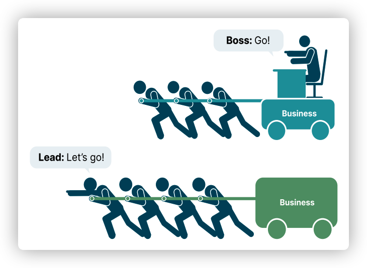

# 关于 Tech Lead 这个角色
Tech Lead 是一个跨越技术和管理的角色。技术是其背景属性，但其职责又不单单是管理。带领团队冲锋陷阵，身先士卒才是 Lead 的精髓所在。主管、经理的意思却大相径庭。Tech Lead 好比战场上将帅的综合体。不但要能力过硬，可以带队冲锋陷阵。同时又要懂得调兵遣将，稳定军心，顾全大局
# 从开发到 Tech Lead
Tech Lead 的要求如此之高，但选拔 Tech Lead 的方式却有些简单。很多开发工程师都是凭借优秀的技术和积极主动的品质成为了 Tech Lead。如此选拔 Tech Lead 看起来合情合理，但细琢磨起来总觉得哪里不太对劲。类似的事情在软件行业每天都在发生。就像电影行业的 “演而优则导”。但其实好演员导出的烂片也不少。

一名 Tech Lead 新人，通常都是一腔热血投入到项目之中，准备大干一场。但很快就会发现各种状况：团队在空转、开发任务被 block、意料之外的问题、代码风格不统一、各种 bug、pipeline 飘红。总之就是团队效率低下、代码质量差。Tech Lead 恨不得高呼一声：都闪开，让我来！但就算是 10 倍程序员，也干不完 20 人的活。虽然推崇“一个队伍像一个人”，但不能真的就只有一个人。作为一名技术工作者，在专业领域取得成绩后，逐步过渡到管理者，这合情合理。但成为 Tech Lead 后，跨越技术到管理、个人到团队的沟壑并不容易，需要艰难的转变过程。对 Tech Lead 身份的充分认知，则是转变的起点。

# Tech Lead 不是 Manager
Tech Lead 需 要 承 担 一 定 的 管 理 职 责， 但 其 并 不 是 Manager（ 经 理）， 所 以 用 技 术 经 理 或 者 主 管 来 对 应
Tech Lead 并 不 准 确。Tech Lead 是 Leader。关于Leader 和 Manager 区别的解读有很多。不过在 Tech Lead 背景下，二者有很多相似之处。但其最核心区别是，Leader 深 处 团 队 之 中， 带 领 团 队 一 起 冲 锋 陷 阵。Manager 坐镇后方，指挥团队。

Leader 是团队的领头羊，冲锋号。对团队的动作多为引领和指导。而 Manager 是发令施号的人，他一般不需要亲自带团队冲锋陷阵。例如上线时，Tech Lead 一定会在现场，带领团队完成一个个任务，碰到难题也会和团队一起想办法解决。Manager 可能也会出现在现场，但大多数时候只是稳定军心，关心一下进度。Tech Lead 带领团队冲锋陷阵，同时又要肩负各种管理职责。并不是某一种我们熟悉的角色就可以完整诠释 Tech Lead 的职责。想要成为合格的 Tech Lead，首要任务是对 Tech Lead 有正确认知

# Tech Lead 角色认知
晋升为团队的技术管理者，意味着升值加薪、更多股票！但更重要地，意味着你的角色发生了变化。没错，你过去的工作方式和经验已经不好用了。过去你只需要做好自己的开发。而现在你需要带领整个团队出色地完成开发工作。是时候学习一些管理知识了，然后和你的专业知识结合起来。现在你不只是开发，还是架构师，甚至项目经理。你是这些角色的综合体，但又不可能面面俱到。有限的时间和经验，应该把技能点点在哪里？应该做什么工作？这需要你对 Tech Lead 角色有正确的认知

# 从个体到团队
作为开发可能最快乐的事情就是一个人写上几个小时的代码，沉浸在造物主的乐趣之中。我不希望，也不想和其他人有过多交流。我只关心我的程序是不是跑通了，是不是写得足够 “工匠精神”。但是当你成为 Tech Lead 的那一天，你会和这种快乐渐行
渐远。
1. 过去你只关心自己程序的设计，现在你要关心系统整体设计。
2. 过去你只关心自己的任务拆分，现在你要关心整个团队的任务拆分。
3. 过去你只关心自己任务的依赖和优先级，现在你要关心团队的任务怎么安排更合理。
4. 过去你只关心自己的代码写的是否够好，现在你要关心整个团队的代码质量。
5. 过去你只关心自己如何学习技术，现在你要关心团队的技术能力成长、每个成员的个人发展。
6. 过去你可以流畅讲出自己的程序实现，现在团队开发的任何内容你都要做到应答如流。

没错，从个人到团队，意味着你要身兼项目经理、架构师、高级开发的工作。

# Tech Lead 是项目经理
从开发到 Tech Lead 的最大转变是开始承担团队管理工作。你要开始从团队管理的视角去思考问题。

• 如何提升团队的开发效率
• 每个成员如何成长
• 技术方案是否全局最优
• 现在项目进度如何
• 项目是否存在风险

诸如以上这些问题，如果成为 Tech Lead 后你还没有开始思考，那么你的团队将十分危险。很多 Tech Lead 新人 ，很容易陷入一个具体问题的解决上，从而忽略团队，对项目缺少规划。这会导致团队效率低下，问题频发。最后的结果就是哪里漏水堵哪里，Tech Lead 一人堵几个最难堵的洞，剩下的洞大家一块堵。整个团队疲惫不堪，项目却做得非常糟糕。

我认为 Tech Lead 除技术之外，最重要的能力就是规划能力。要想做好规划，需要清楚知道团队的能力，细化工作任务，识别出项目的潜在风险。一句话，项目的一切尽在掌握。

# Tech Lead 是架构师、高级研发
Tech Lead 的技术一定要过硬，这是成为 Tech Lead 的基本要求。可能你的某项技术并不是团队中最好的，但你一定要具备一定的技术广度。此外最重要的是快速学习的能力，能够短时间掌握新技术、解决问题。当团队碰到技术难题，Tech Lead 肯定是冲在前面，带领团队一起攻克难关的人。注意，是带领团队，而不是 Tech Lead 一个人解决难题。Tech Lead 需要合理利用团队能
力，找到合适的人、合适的方法来解决问题。如果 Tech Lead 总是一个人钻研技术难题，这并不是正常现象。

Tech Lead 在技术层面需要关注如下三件事：
1. 为团队建立技术标准，并带团队遵守标准
2. 关注架构和方案设计，自己参与或者审查团队成员的设计
3. 带领团队解决技术难题

# Tech Lead 是沟通达人
作为 Tech Lead，沟通是非常重要的技能。你不能再一个人沉浸在代码世界里了。请你和每一位开发沟通！和项目经理沟通！和客户沟通！一开始会有些胆怯，甚至都表达不清楚。这非常正常，沟通是每一位工程师相对欠缺的技能。没办法，谁让咱前几年把技能点都点在了技术上。沟通也有一定方法，掌握方法的同时，大胆去沟通，不怕犯错。只有不断实践，才能跨过沟通的障碍。
# Tech Lead 还是那个技术极客
Tech Lead，根基在 Tech 上。除了团队的工作之外，一定要给自己留有学习技术、编写代码的时间。成为 Tech Lead 后，你会发现管理的事情永远做不完。这是因为管理的工作成果不如编码具像化。你会觉得自己再多思考一会，就会有更好的结果。此种情况下，Tech Lead 如果不给自己规划好钻研技术的时间，会使自己很久不碰代码、不学习新技术。当很多Tech Lead 意识到这个问题的时候，自己已经远离技术很久。
你虽然成为了 Tech Lead，但你骨子里还应该是那个技术极客。请继续保持对技术的热爱，不要远离代码。只有根扎的深，树才长得高，结的果实也会更多！

