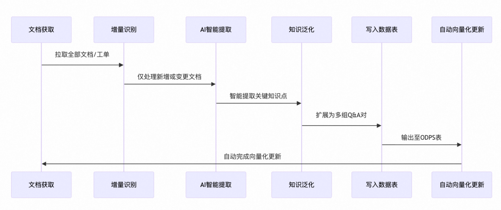
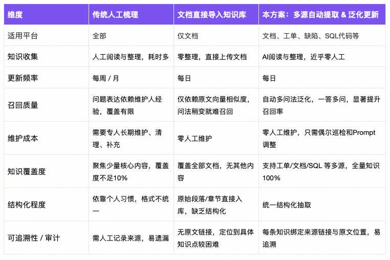
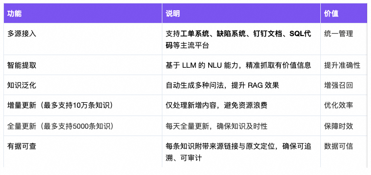

# RAG 自动化迭代思路

## 传统方案的困境

在大部分 Agent 项目里，一个绕不过去的问题是：知识从哪里来、怎么持续更新。

在日常工作中，大量有价值的知识分散存储在工单系统、文档库、甚至SQL代码等各个平台的各个角落。但 Agent 需要的是一份「结构化、可向量化、可持续维护」的知识库，因此当我们需要构建 Agent 知识库时，这些知识的收集、整理和维护成为了巨大的挑战。

传统做法存在两种路径，但都有明显缺陷：

- 路径一：人工精细化处理 
- 优势：质量可控，准确性高；问题：耗时耗力，需要定期人工维护更新。

- 路径二：批量直接导入 
- 问题：切分不准确,知识未泛化,RAG 效果差。

## 核心痛点

- 知识收集困难

  - 分散存储：知识分布在多个平台（工单、文档等），人工收集效率极低。
  - 格式不统一：缺乏统一 标准，不同人提取的内容格式不一致，难以结构化管理。

- RAG 召回质量差

  - 切分不准：原始文档直接导入，非智能分段导致切分不准确。

  - 覆盖不全：单一 Q&A 格式无法覆盖用户多样化的提问方式，换一种问法就检索不到知识。

- 维护成本高昂

  - 人工维护：需要专人定期检查更新，响应滞后。

  - 易遗漏：人工操作易遗漏，无法实现实时同步。

## 方案
文档获取 → 增量识别 → AI 智能提取 → 知识泛化 → 写入数据表 → 自动向量化更新

### 功能模块
