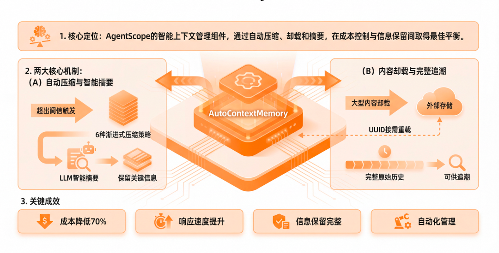
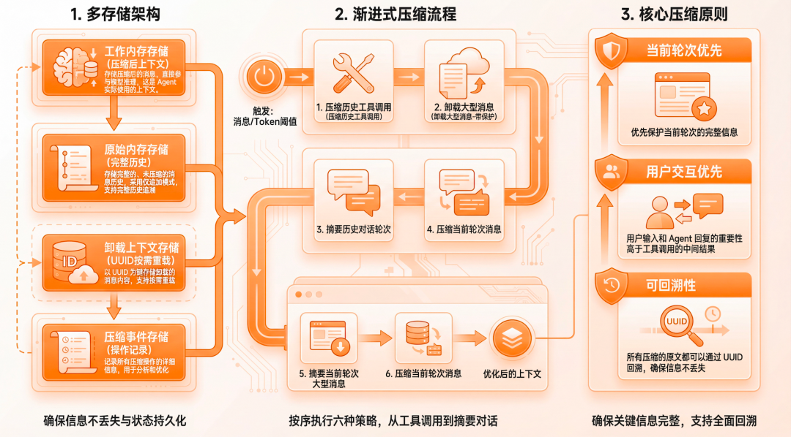

# 多轮对话中 LLM 上下文超限的优化方案

在多轮对话系统中，随着交互轮数增加，历史消息不断累积，最终超过 LLM 的 token 上下文窗口限制（如 8K、32K 等），导致无法继续对话或关键信息被截断。

> **核心目标**：在有限上下文内，高效保留最有价值的对话历史，维持语义连贯性与任务完整性。


## ✅ 推荐方案（按优先级排序）

### 1. 对话摘要压缩【首选】

#### 原理
当历史接近上限时，用 LLM 自身对前面的对话进行摘要，用一段简短文字替代原始多轮记录。

#### 实现步骤
1. 监控当前上下文 token 数（使用 `tiktoken` 或模型 tokenizer）
2. 当达到阈值（如 70% 上限），触发摘要：
   ```text
   请将以下对话总结为一段简洁的背景描述，保留关键事实、用户意图和已达成的结论：

   [完整历史对话]
   ```
3. 将返回的摘要作为新的“系统记忆”，后续对话以此为基础追加新消息

#### 示例
- 原始历史（5 轮）：3000 tokens
- 摘要后：200 tokens
- 新上下文 = [摘要] + [最新1–2轮]

> 💡 进阶：采用分层摘要（每 N 轮摘要一次，形成摘要链）

### 2. 滑动窗口 + 关键轮次保留

   只保留最近 N 轮对话，但强制保留关键锚点轮次。

#### 实现
- 基础滑动：仅保留最后 3–5 轮（通常足够维持上下文）
- 锚点保留：
  - 用户首次提问（定义任务目标）
  - Tool 调用的输入/输出
  - 用户明确纠正或确认的信息（如 “不是 A，是 B”）
#### 示例结构
```python
history = [
{"role": "anchor", "content": "用户想订北京到上海的机票"},  # 锚点
{"role": "user", "content": "昨天说的航班有变动吗？"},
{"role": "assistant", "content": "CA1832 仍正常..."}
]
```
#### 适用场景
- 资源受限
- 通用聊天机器人

### 向量化记忆 + 动态检索（RAG for Chat History）

   将每轮对话嵌入向量库，每次生成前根据当前 query 检索最相关的过往片段。

#### 流程
- 每轮结束后，存入向量数据库
- 下次生成前：
  - 用当前用户消息做 embedding
  - 检索 Top-K 相关历史轮次
  - 拼接为：[检索结果] + [最近1–2轮]
#### 优势
  - 精准回忆早期细节
  - 支持话题跳跃


### 结构化状态管理（State Tracking）

   维护一个结构化对话状态对象，不传递原始对话。

#### 示例（订票场景）
```json

{
"task": "book_flight",
"slots": {
"origin": "Beijing",
"destination": "Shanghai",
"date": "2025-05-01",
"confirmed": false
},
"summary": "用户正在查询北京到上海5月1日的航班"
}
```
## 🛠️ 工程实践建议

1. **动态 Token 计算**
   使用模型对应的 tokenizer（如 Qwen 用 `tiktoken` + custom rules）实时统计 token。
2. **混合策略组合**
  * 日常对话：滑动窗口 + 锚点
  * 复杂任务：摘要压缩 + 结构化状态
  * 专业咨询：向量化记忆
3. **前端配合**
   UI 层也做历史折叠（如 “… earlier conversation summarized”），提升体验一致性。
4. **监控告警**
   记录因上下文截断导致的用户追问（如 “我之前说过…”），用于策略迭代。


## 开源方案 AutoContextMemory：智能上下文管理


面对这些挑战，AgentScope推出了AutoContextMemory ，它是 AgentScope Java 框架提供的智能上下文内存管理组件，通过自动压缩、卸载和摘要对话历史，在成本控制和信息保留之间找到最佳平衡。


### 核心价值

1. 自动压缩与智能摘要

当消息或 token 数量超过阈值时，自动触发 6 种渐进式压缩策略；
使用 LLM 智能摘要，保留关键信息而非简单截断；
无需人工干预，系统自动管理。
2. 内容卸载与完整追溯

将大型内容卸载到外部存储，通过 UUID 按需重载；
所有原始内容保存在原始存储中，支持完整历史追溯；
不会因为压缩而丢失任何信息。
3. 实际效果

✅ 成本降低 70%：通过智能压缩，大幅减少 token 使用量；
✅ 响应速度提升：更小的上下文意味着更快的处理速度；
✅ 信息保留完整：关键信息不会丢失，Agent 决策质量不受影响；
✅ 自动化管理：无需人工干预，系统自动优化。


### AutoContextMemory架构与工作原理


多存储架构

AutoContextMemory 采用多存储架构，确保在压缩的同时保留完整信息：

工作内存存储：存储压缩后的消息，直接参与模型推理，这是 Agent 实际使用的上下文；
原始内存存储：存储完整的、未压缩的消息历史，采用仅追加模式，支持完整历史追溯；
卸载上下文存储：以 UUID 为键存储卸载的消息内容，支持按需重载；
压缩事件存储：记录所有压缩操作的详细信息，用于分析和优化；
所有存储都支持状态持久化，可以结合 SessionManager 实现跨会话的上下文持久化。

6 种渐进式开箱即用压缩策略

AutoContextMemory 的核心是 6 种渐进式压缩策略。

压缩触发条件：

消息数量阈值 或者 Token 数量阈值,两个条件满足任一即触发压缩。

压缩流程：

检查阈值 → 策略1(压缩历史工具调用) → 策略2(卸载大型消息-带保护)
→ 策略3(卸载大型消息-无保护) → 策略4(摘要历史对话轮次)
→ 策略5(摘要当前轮次大型消息) → 策略6(压缩当前轮次消息)
压缩原则：

当前轮次优先：优先保护当前轮次的完整信息；
用户交互优先：用户输入和 Agent 回复的重要性高于工具调用的中间结果；
可回溯性：所有压缩的原文都可以通过 UUID 回溯，确保信息不丢失；
6 种压缩策略：

1. 压缩历史工具调用：查找历史对话中的连续工具调用消息（超过 6 条），使用 LLM 智能压缩，保留工具名称、参数和关键结果。轻量级策略，压缩成本低。
2. 卸载大型消息（带保护）：查找超过阈值的大型消息，保护最新的助手响应和最后 N 条消息，卸载原始内容并替换为预览和 UUID 提示。快速减少 token 使用。
3. 卸载大型消息（无保护）：与策略 2 类似，但不保护最后 N 条消息，仅保护最新的助手响应。更激进的压缩策略。
4. 摘要历史对话轮次：对历史用户-助手对话对进行智能摘要，使用 LLM 生成摘要保留关键决策和信息。大幅减少 token 使用。
5. 摘要当前轮次大型消息：查找当前轮次中超过阈值的大型消息，使用 LLM 生成摘要并卸载原始内容。针对当前轮次的优化。
6. 压缩当前轮次消息：压缩当前轮次的所有消息，合并多个工具结果，保留关键信息。最后的保障策略，确保上下文不超限。


## CodeGenius Memory 的设计与演进
早期 CodeGenius 采用了固定窗口来管理上下文，我们只保留最近 5 轮的完整对话，这种策略在产品早期非常简单有效，但随着编码任务越来越复杂，该方案面临着 3 个主要问题：
- 上下文断裂：复杂任务往往需要超过 5 轮对话才能完成，固定截断会导致前面的重要信息丢失，模型“忘记”用户的原始意图。
- 缓存失效：每次截断都会改变 Prompt 的内容，导致之前的缓存无法复用，需要重新进行完整推理，增加了推理成本和延迟。
- 冗余信息干扰：长对话中会积累大量重复引用的文件内容，以及早已过时的工具调用结果。这些无效信息不仅占用 Token 额度，还会干扰模型判断，降低代码生成质量。

随着项目规模扩大，需求越来越复杂，这种固定窗口机制已不再适用。因此，我们为 CodeGenius 构建了一个新的 Memory 系统，使其能够在长任务、长对话、多文件、多工具的复杂场景下：
- 控制上下文规模
- 保留关键语义
- 提升模型稳定性
- 降低成本与延迟
- 让 Agent 能够真正连续执行任务


方案的核心是三件事：
1. 卸载过时信息
2. 文件去重和摘要生成
3. 动态对话摘要

优化方案遵循「输入 → 整理 → 压缩 → 生成」流程，核心目标是保持上下文稳定性，以提高提示词缓存命中率，同时通过分层处理保证跨轮次连续性。

### 卸载过时信息
当和模型进行多轮对话后，历史消息中的很多信息其实是冗余的，比如实现上个目标而查看/编写的代码，已经使用过的组件文档等等。这些过时的内容占用着大量的 Token，增加成本和延迟的同时还会干扰模型的注意力分配，使推理行为偏离当前目标。因此，我们对 5 轮对话之前的工具出入参进行了卸载，将这些信息从 LLM 上下文中移除并存储到文件当中，留给模型的只有文件路径和提示信息，后续需要时可以重新读取文件内容查看或者通过 grep 获取关键信息。

因为卸载信息并不是 append-only 的模式，需要对历史消息进行修改。如果 5 轮对话后，每次都进行卸载会导致缓存持续失效，反而得不偿失。为了尽可能保持上下文的稳定性，我们对卸载设置了 batch size，每过 5 轮进行一次卸载，这样既有效移除了过时信息，同时也享受到了缓存带来的成本和延迟的降低。

### 文件去重和摘要生成

文件类内容在上下文中往往是最大开销来源，当多轮对话中一直挂载着同一个文件，如果每次都带着最新的文件内容给模型会导致上下文膨胀得很快。现在的模型已足够智能，模型能够根据文件原始内容和编辑路径推断出最新的内容。因此，我们的策略是：遵循 append-only 的模式，只在第一次添加文件时带上完整代码，后续只在手动编辑代码后提供 diff 内容，其他情况都只提供文件路径，不再附带内容。

除此之外，我们还发现有时一个大文件就占据了大部分模型上下文，但对这次需求来说，其中大部分内容都是无效的，真正关键的代码只有几行。为了解决这个问题，我们在检测到文件过大时（文件大于 3000 行）利用 tree-sitter 对文件进行了压缩，生成了只包含类型定义、变量和函数签名等重要信息的摘要。有了带行号的摘要，模型会在需要时缩小查看范围，只读取其中的关键内容。

这就像只告诉模型一本书的**目录**，而不是全文，让模型按需获取相关内容。通过这种方式，在上下文有限的情况下，完美解决了大文件无法一次性加载到模型上下文的问题。


### 动态对话摘要

即使已经通过卸载、去重和结构摘要等手段显著降低了上下文体积，上下文仍会随着对话轮次的增长不断膨胀。对于需要多轮对话的复杂任务来说，如果不主动清理上下文，迟早会触及模型的最大窗口，导致成本上升、推理变慢，甚至模型无法继续工作。

因此，我们为 CodeGenius 设计了一套能够根据上下文状态动态触发的对话摘要机制，用于在关键时刻“折叠历史”，确保 Agent 始终在可控范围内运行。

摘要生成部分我们直接使用了 Claude Code Compact 的提示词，该提示词会让模型生成一份极其详细、结构化的对话总结，总结会包含九个结构化部分：
Primary Request and Intent: 重点描述用户在对话中的主要目标、核心需求和明确意图• Key Technical Concepts: 列出整个对话涉及的重要技术点、框架、工具、概念等；
Files and Code Sections: 记录讨论或修改过的具体文件、代码片段、函数签名，以及这些操作的目的；
Errors and Fixes: 总结出现过的错误、产生原因、如何修复，以及用户对修复的反馈；
Problem Solving: 整理在对话中完成的关键问题解决步骤与正在进行的排查工作；
All User Messages: 列出所有用户的消息，用于完整保留用户需求和每轮反馈；
Pending Tasks: 列出用户明确要求但尚未完成的任务；
Current Work: 描述助手在总结前正在进行的具体工作内容，包括相关文件和代码状态；
Optional Next Step: 在用户现有指令范围内，给出下一步明确且与当前工作直接相关的行动建议；


经过压缩后，上百 K 的上下文会浓缩成 2～3 K 的摘要信息，大幅减少上下文的同时还保留着任务的关键信息。这种定量清理的策略，不仅降低了 Agent 的调用成本，也解决了复杂任务场景下上下文窗口不够的问题。

触发摘要生成的时机有两个：
- 上下文即将逼近模型窗口上限：当上下文使用量达 70% 时，系统会提前触发压缩，避免溢出风险；
- 开启与历史无关的新话题：识别到用户输入与历史意图不相关，系统会主动对历史对话进行压缩，为新任务腾出空间；

第一个时机是为了模型稳定迫不得已，而第二个时机则是我们发现有些用户总是在同一个会话中不断向模型许愿实现需求，即使是不同的需求也不会新开会话减少无用信息的干扰。因此，我们从成本和生成质量的角度考虑，对用户输入进行识别，如果和之前的内容无关，就会触发自动压缩来减少过时信息的 Token 占用。

如果每次都对用户输入进行识别，会导致用户等待时间过长，并且有可能压缩后的 Token 占用比原上下文更大，反而不划算。我们的策略是判断历史上下文 Token 占用是否超过 3K（通常摘要占 2～3K），确保用摘要替换历史长下文能节省 Token 才会进行压缩。

关于新话题的判断还有两处细节需要注意：
- 一是因为开启了缓存，命中缓存成本只有十分之一，所以我们还判断了用户输入距上次是否在五分钟内（缓存时间），如果在五分钟内，历史上下文 Token 占用超过 30K 才会压缩。
- 二是判断新话题无需将整个上下文都给模型。为了加快判断速度，我们只取了最近 3 轮的历史上下文用于判断，同时对模型输出的部分做了剪裁，移除模型中间的思考过程和工具调用，只取模型输出轮次的最后一段文本内容。模型最后一般都会对这次生成做一次总结，因此最后一段文本算是模型输出的摘要，对判断新话题来说已足够。