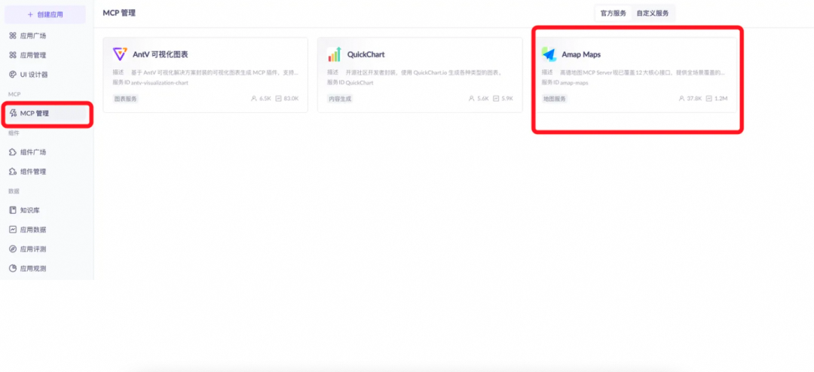
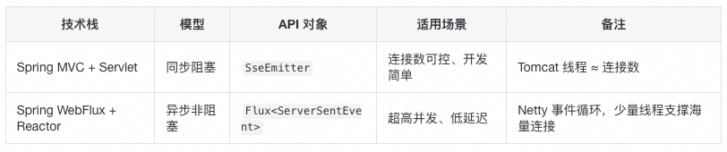
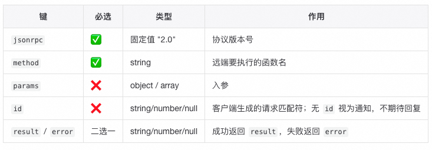
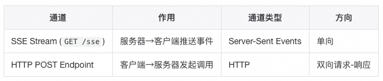
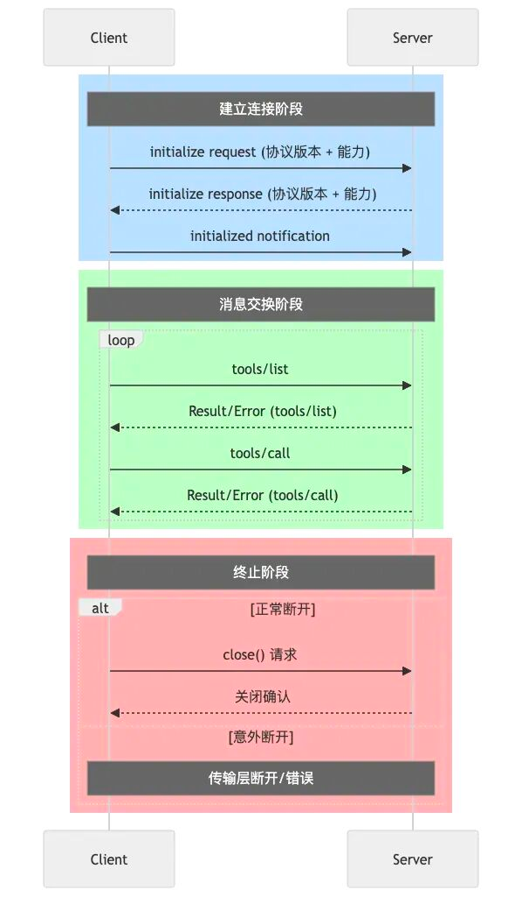

# MCP 技术原理

## MCP介绍

### 什么是MCP？

MCP本质上是MCP Client和MCP Server之间的通信协议，实现了Agent开发与工具开发的解耦。

### 协议具体如何运作

1. MCP Client：负责发送请求/接收响应

2. MCP Server：处理请求并返回上下文数据

3. MCP Host：MCP协议的执行者。负责：

接收用户问题 → 选择工具 → 构建参数 → 通过Client调用Server → 解析结果 → 继续对话

> 集成 MCP Client 的智能体执行平台（如 IDEA LAB）或模型厂商的 Agent/AI 客户端（如 Cherry Studio）均可承担 MCP Host 职能。

### 一个MCP Client的例子：

```java
@Slf4j
publicclassMcpClient {

    private String baseUri;        // MCP 服务器基础地址
    private String sseEndpoint;    // SSE 连接端点
    private String messageEndpoint; // HTTP POST 消息端点
    private SseClient sseClient = new SseClient(); // SSE 客户端实例
    
    // 异步任务管理 - 用于同步连接状态和请求响应
    private CompletableFuture<Void> connectFuture = new CompletableFuture<>();  // 连接建立完成信号
    private CompletableFuture<Void> initFuture = new CompletableFuture<>();     // 初始化完成信号
    
    // 待处理的请求映射表：requestId -> 对应的Future对象
    privatefinal Map<String, CompletableFuture<Map<String, Object>>> pendingRequests = new ConcurrentHashMap<>();
    
    privatefinal ObjectMapper objectMapper = new ObjectMapper(); // JSON 序列化工具
    
    /**
     * MCP 客户端构造函数
     * @param baseUri MCP 服务器地址
     */
    publicMcpClient(String baseUri){
        this.baseUri = baseUri;
        this.sseEndpoint = baseUri;
        
        // MCP 协议规定的三步初始化流程
        this.connect();           // 1. 建立 SSE 连接，获取 POST 端点
        this.sendInitialize();    // 2. 发送初始化请求，协商协议版本和能力
        this.sendNotification("notifications/initialized", null);  // 3. 发送初始化完成通知
    }
}
```
### MCP Server长这样子：

图片
MCP Host上注册好MCP Server以后，我们这个智能体应用就可以调用MCP Server了。


## MCP解决的核心问题

1. 让模型调用接口更简单，把接口上下文一键喂给LLM

有了统一协议，IDEA LAB、通义千问等平台的AI客户端（MCP Host）内置MCP Client，按协议通信。我们只需把自己的接口封装成MCP Server，接入平台即可；选工具、拼参数、调接口、解析结果等链路由平台自动完成。

2. 实现了Agent开发与工具开发的解耦，类似于前后端解耦的意义

所有平台支持MCP协议后，工具按MCP Server标准发布，Agent即可直接调用，无需再关心"选-拼-调-解"全流程，真正做到工具开发与Agent开发分离。

## MCP技术原理深度解析

### SSE（Server-Sent Events）：MCP Client和MCP Server之间的数据传输方式
   
SSE全称Server-Sent Events，是一种基于HTTP协议实现的Web技术，专门用于服务器向客户端实时推送数据。它通过建立持久的HTTP连接，让客户端监听事件流，从而实时接收服务器推送的数据。

那么sse是如何做到实时推送的呢？

其实，SSE采用了一种巧妙的变通方法：虽然底层仍然是请求-响应模式，但响应的不是一个简单的数据包，而是一个持续不断的流信息（stream）。这就像是一次耗时很长的下载过程，让数据源源不断地流向客户端。正因为SSE基于HTTP实现，所以浏览器天然支持这一技术，无需额外配置。

>在 MCP 体系里，SSE 就是"用一次超长时间的 HTTP 下载"来伪装成服务器主动推送；规范极简（4 个固定字段），浏览器原生支持，Spring 既可用同步阻塞的 SseEmitter，也可用响应式的 Flux 实现。

### SSE在MCP中的定位
1. 定位：实现MCP Server → MCP Client 的单向实时数据流，解决「怎么传」
2. 本质：
   依旧走 HTTP/1.1，复用现有基础设施；
   长连接 + text/event-stream 响应，把"请求-响应"拉成"长时间下载"。
   二、协议格式（只需记 4 个字段）
   
Header
```
Content-Type: text/event-stream
Cache-Control: no-cache
Connection: keep-alive
```

Body
```
field: value\n\n          /* 每条消息以两个换行结束 */
```
服务器发送给浏览器的body必须按上述k-v格式符合，其中field的类型是固定的四种字段：

- data 实际负载
- id 事件序号，断线续传用
- event 事件类型，前端 addEventListener('event名')
- retry 断线重连间隔（ms）

### MCP 实战示例

MCP Server返回给MCP Client的SSE数据包如下：
```
event: endpoint
data: /message?sessionId=fc92c0fc-6222-466c-b353-bdc4931980a6

event: message
data: {"jsonrpc":"2.0","id":"0","result":{"capabilities":{"tools":{"listChanged":true}},"serverInfo":{"name":"SpringBoot MCP Server","version":"1.0.0"},"protocolVersion":"2024-11-05"}}

event: message
data: {"jsonrpc":"2.0","id":"1","result":{"tools":[{"inputSchema":{"type":"object","properties":{"name":{"description":"Name to greet (optional)","type":"string"}}},"name":"hello_world","description":"Returns a Hello World message"},{"inputSchema":{"type":"object","properties":{}},"name":"get_time","description":"Returns current server time"},{"inputSchema":{"type":"object","properties":{"message":{"description":"Message to echo back","type":"string"}}},"name":"echo","description":"Echoes back the provided message"}]}}

event: message
data: {"jsonrpc":"2.0","id":"2","result":{"content":[{"text":"Hello, 宸游!","type":"text"}]}}
```
## 实现路线对比

## 代码级 Demo
### Java实现SSE方式一：Spring MVC（阻塞式）

通过返回一个 SseEmitter 对象作为事件发射器给到前端，然后我们在后端调用 emitter.send() 方法发送的数据会被封装为SSE事件流的形式，前端可以通过监听该事件流来进行数据更新。
```java
@GetMapping(value="/stock-price", produces=TEXT_EVENT_STREAM_VALUE)
public SseEmitter stream(){
SseEmitter e = new SseEmitter();
new Thread(() -> {
while(true){
e.send(SseEmitter.event().data(price));
sleep(1000);
}
}).start();
return e;
}
```
前端

在js中通过 new EventSource 建立一个EventSource对象，它会与"/stock-price"这个路径建立sse长连接，并监听事件。当后端发送event事件以后，会触发 eventSource.onmessage 这个回调函数，将数据写入到页面中。

const es = new EventSource("/stock-price");
es.onmessage = e => document.body.innerText = e.data;
### Java实现SSE方式二：Spring WebFlux（响应式）

返回publisher给到前端进行订阅，然后我们在后端通过 Sinks.Many<ServerSentEvent<?>> 这个类的 tryEmitNext 方法来手动发送事件给到前端，前端可以通过监听该事件流来进行数据更新。
```java
@GetMapping("/stream-sse")
public Flux<ServerSentEvent<String>> stream() {
return Flux.interval(Duration.ofSeconds(1))
.map(i -> ServerSentEvent.builder()
.id(i.toString())
.event("tick")
.data("now=" + LocalTime.now())
.build());
}
```
前端同上。

## JSON-RPC 2.0：MCP Client和MCP Server之间的传输的内容格式
   JSON-RPC 2.0 是一种无状态、轻量级的远程过程调用(RPC)协议，定义了MCP Client和MCP Server之间进行通信的格式。JSON-RPC 2.0协议定义了请求和响应的格式，以及错误处理机制。

> 在 MCP 里，Client与 Server永远只交换一条"四字段" JSON-RPC 2.0 消息：版本 jsonrpc、方法 method、编号 id、载荷 params/result|error

### JSON-RPC 2.0 在 MCP 中的定位
1. 定位：定义MCP Server和MCP Client之间的统一的无状态消息格式，解决「说什么」
2. 本质：通过无状态、轻量级的四字段 JSON 契约，实现两端零差异解析。
   
3. 消息骨架（记住 4 个固定键）
 
4. 完整范式
- 请求
```
{ "jsonrpc": "2.0", "method": "...", "params": {...}, "id": <unique> }
```
- 响应
```
{ "jsonrpc": "2.0", "id": <same>, "result": {...} }   // 成功
{ "jsonrpc": "2.0", "id": <same>, "error": {code, message, data?} } // 失败
```
## MCP 实战示例：initialize请求
客户端 → 服务器
```
{
"jsonrpc": "2.0",
"method": "initialize",
"params": {
"protocolVersion": "2024-11-05",
"capabilities": {
"sampling": {},
"roots": { "listChanged": true }
},
"clientInfo": { "name": "mcp-inspector", "version": "0.9.0" }
},
"id": 0
}
```
服务器回同样 id 的响应，宣告双方能力，即可进入正式会话。

### MCP协议：MCP Client和MCP Server之间的通信（调用）协议
   
MCP本质上是MCP Client和MCP Server之间的通信协议，那么这个MCP协议具体定义了写什么内容呢？

1. 定义了MCP Server和MCP Client之间的连接建立过程；
2. 定义了MCP Client和MCP Server之间如何进行信息（上下文）交换；
3. 定义了MCP Client和MCP Server之间如何连接关闭过程；
> MCP 协议就是"客户端先拉一条 SSE 长连接收通知，再用普通 HTTP POST 发请求到服务端；Client和Server之间必须先发 initialize 打招呼，才能调工具，最后Client关 SSE 就通信结束了"。

### 协议定位 & 本质

定位： 在 SSE + JSON-RPC 2.0 之上，定义 两通道、四步骤、全生命周期 的MCP Server与 MCP Client 通信协议

本质： 把"怎么连、怎么握手、怎么调工具、怎么结束"写死成固定流程，MCP Host只需照表填空，就可以实现LLM获取MCP Server提供的上下文。

### MCP Server 和 MCP Client 之间的通信"两通道"


服务器启动时必须同时暴露这两个端点，缺一不可。

### MCP Server 和 MCP Client 之间的通信"四步骤"
1. 连 客户端 发送GET /sse请求，建立sse长连接 ，用于后续服务端推送数据给客户端 ；
2. 取 服务器回 event: endpoint 的消息，给出后续客户端发送信息给服务端的POST 端点 URI ；
3. 握 客户端向该 URI 发两包 JSON-RPC；
   initialize 请求 → 服务器返回 capabilities；
   notifications/initialized 通知 → 握手完成 ；
4. 用 正常会话；
   tools/list（可选）拉可用工具；
   tools/call 调用具体工具；
   服务器随时在 SSE 流里推送状态更新 ；
5. 断 任一端关闭 SSE，会话结束。

### MCP Server 和 MCP Client 之间的通信"生命周期"

