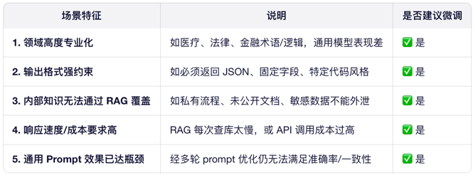
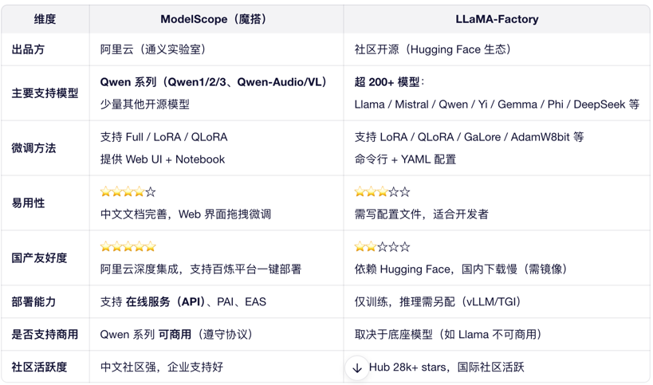

# 大模型微调

## 需要微调的场景
> 简单场景不建议微调，优先尝试 Prompt Engineering + RAG（检索增强生成）
> 


## Qwen 大模型微调完整方案（以 Qwen2-7B 为例）

### Step 1：准备环境
```bash
编辑
# 创建虚拟环境
conda create -n qwen-ft python=3.10 -y
conda activate qwen-ft

# 安装核心库（推荐 unsloth 加速）
pip install "unsloth[colab-new] @ git+https://github.com/unslothai/unsloth.git"
pip install transformers accelerate datasets peft trl bitsandbytes
```

### Step 2：准备数据集
格式：JSONL（每行一个样本）
结构（对话格式）：
```json

{
"messages": [
{"role": "user", "content": "如何查询用户余额？"},
{"role": "assistant", "content": "请调用 getUserBalance(userId) 接口。"}
]
}
```
要求：
数据量：≥ 500 条（越多越好，建议 1k~10k）
覆盖所有业务场景
清洗噪声、统一格式
✅ 工具：用 datasets 库加载：

```python

from datasets import load_dataset
dataset = load_dataset("json", data_files="train.jsonl", split="train")
```
### Step 3：选择微调方式（推荐 LoRA）
|方法	|显存需求（7B）|	优点|	缺点|
|------|-------------|-------|------|
|Full Fine-tuning|	≥ 80GB|	效果最好|	成本高，需多卡
|LoRA|	≈ 16GB	|快、省显存、可合并|	少量性能损失
|QLoRA	|≈ 10GB	|极致省显存	|速度略慢
> 推荐 LoRA：90% 场景够用，Qwen 官方也提供 LoRA 示例。

### Step 4：编写训练脚本（基于 unsloth + LoRA）
```python
from unsloth import FastLanguageModel
from trl import SFTTrainer
from transformers import TrainingArguments

# 1. 加载 Qwen2-7B（4-bit 量化节省显存）
model, tokenizer = FastLanguageModel.from_pretrained(
"Qwen/Qwen2-7B",
load_in_4bit=True,  # QLoRA
)

# 2. 添加 LoRA 适配器
model = FastLanguageModel.get_peft_model(
model,
r=64,          # LoRA rank
target_modules=["q_proj", "k_proj", "v_proj", "o_proj",
"gate_proj", "up_proj", "down_proj"],
lora_alpha=128,
lora_dropout=0,
bias="none",
use_gradient_checkpointing=True,
)

# 3. 格式化数据为 ChatML（Qwen 格式）
def formatting_prompts_func(examples):
convos = examples["messages"]
texts = [tokenizer.apply_chat_template(convo, tokenize=False) for convo in convos]
return {"text": texts}

# 4. 训练配置
trainer = SFTTrainer(
model=model,
tokenizer=tokenizer,
train_dataset=dataset.map(formatting_prompts_func, batched=True),
dataset_text_field="text",
max_seq_length=2048,
dataset_num_proc=2,
packing=False,
args=TrainingArguments(
per_device_train_batch_size=2,
gradient_accumulation_steps=4,
warmup_steps=5,
num_train_epochs=3,
learning_rate=2e-4,
fp16=not torch.cuda.is_bf16_supported(),
bf16=torch.cuda.is_bf16_supported(),
logging_steps=1,
output_dir="qwen2-7b-lora-finetuned",
optim="adamw_8bit",  # 8-bit AdamW
),
)
trainer.train()
```

### Step 5：保存与合并模型
```python

# 保存 LoRA 适配器（仅几百 MB）
model.save_pretrained("lora_adapter")

# 合并到原模型（用于部署）
from unsloth import FastLanguageModel
model, tokenizer = FastLanguageModel.from_pretrained("Qwen/Qwen2-7B")
model = PeftModel.from_pretrained(model, "lora_adapter")
model = model.merge_and_unload()  # 合并
model.save_pretrained("qwen2-7b-finetuned")
tokenizer.save_pretrained("qwen2-7b-finetuned")
Step 6：推理部署
python
编辑
# 使用 vLLM 高性能推理（推荐）
from vllm import LLM, SamplingParams

llm = LLM(model="qwen2-7b-finetuned", tensor_parallel_size=1)
sampling_params = SamplingParams(temperature=0.1, top_p=0.9)

prompt = tokenizer.apply_chat_template(
[{"role": "user", "content": "如何重置密码？"}],
tokenize=False
)
outputs = llm.generate(prompt, sampling_params)
print(outputs[0].outputs[0].text)
```

## 低成本方案
