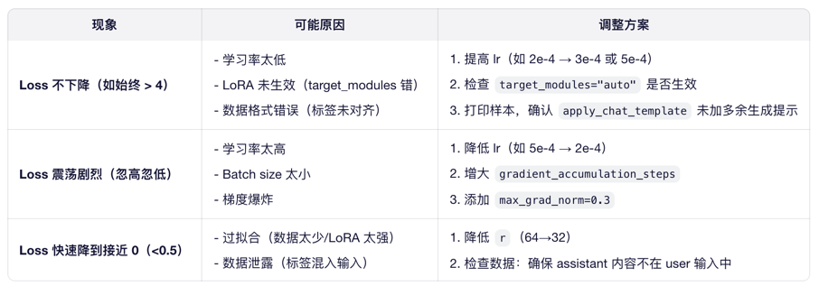
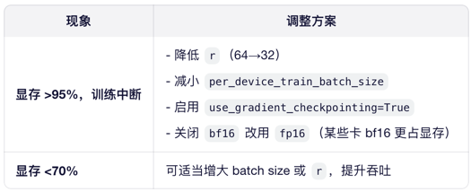

# LoRA 微调核心参数及关键指标

## 1. r（Rank / 低秩维度）
含义：LoRA 分解矩阵的秩（即中间 bottleneck 维度）。
典型值：8、16、32、64、128

影响：
- r 越大 → 可学习参数越多 → 模型表达能力越强，但显存/计算开销增加，过拟合风险上升。
- r 越小 → 更高效，但可能欠拟合。

> ✅ 建议：
初次实验：从 r=64 开始（7B~13B 模型常用）。
显存紧张：尝试 r=32 或 r=16。
小数据集（<1k 样本）：避免 r > 64，防止过拟合。
大数据集（>10k）：可尝试 r=128。 
>
> 📌 经验法则：r=64 是 Qwen/Llama 系列 7B~13B 模型的“甜点”。

## 2. lora_alpha（缩放因子）
含义：控制 LoRA 更新幅度的缩放系数，实际更新为 (ΔW = A × B) × (alpha / r)。
典型值：16、32、64、128（常设为 alpha = 2 * r）

影响：
- alpha 越大 → LoRA 权重更新越强 → 更快适应新任务，但也可能破坏预训练知识。
- alpha 过小 → 更新太弱，训练无效。
> ✅ 建议：
固定比例：lora_alpha = 2 * r（如 r=64 → alpha=128）是社区广泛验证的有效组合。
不要单独调 alpha，优先调整 r，再按比例设 alpha。

## 3. lora_dropout
含义：在 LoRA 适配器内部添加 dropout，用于正则化。
典型值：0.0、0.05、0.1

影响：
Dropout 可缓解过拟合，但会略微降低训练速度。
在小数据集上有用，大数据集通常不需要。
> ✅ 建议：
默认设为 0.0（尤其配合量化 + 小 batch 时，dropout 可能不稳定）。
若观察到严重过拟合（训练 loss ↓ 但验证指标 ↑），可尝试 0.05~0.1。

## 4. target_modules（目标模块）
含义：指定哪些层插入 LoRA 适配器。

常见选择：
- Llama/Qwen 架构：["q_proj", "k_proj", "v_proj", "o_proj", "gate_proj", "up_proj", "down_proj"]
- 仅 Attention：["q_proj", "v_proj"]（节省显存，适合简单任务）
> ✅ 建议：
使用 "auto"（如 Unsloth、PEFT 库支持）：自动匹配模型架构。
手动指定时，务必确认模型层命名（打印 model 查看）。
避免只加在 o_proj 或 down_proj，效果通常较差。

## 5. bias
含义：是否训练 bias 参数。

选项："none"、"all"、"lora_only"
> ✅ 建议：
始终设为 "none"：现代 LLM（如 Qwen、Llama）通常不使用 bias，或 bias 已被归一化层吸收。
设为 "all" 会显著增加可训练参数，得不偿失。
> 
## 6. modules_to_save（可选）
用途：额外保存某些非 LoRA 模块（如分类头、embedding 层）。

场景：指令微调一般不需要；仅在下游任务 head 改变时使用（如分类）。
✅ 建议：指令微调（SFT）场景留空。

## 监控的核心指标
### 1. Training Loss（训练损失）
在哪里看：trainer.train() 日志中的 loss 字段。
   
理想趋势：
   - 前 50~100 步：Loss 快速下降（从 5~10 降到 2~3）。
   - 后续：平滑下降，无剧烈震荡。

异常信号 & 调整建议：

### 2. GPU 显存占用（Memory Usage）
   
工具：nvidia-smi 或 torch.cuda.memory_summary()
   
目标：留出 10%~20% 显存余量，避免 OOM。
   
异常 & 调整：

### 3. 每步耗时（Step Time / Throughput）
   
日志字段：Iteration X / Y (Zs/it) 或 samples/sec
   
意义：反映训练效率。
   
优化方向：
   - 若 packing=False 且序列长度差异大 → 考虑 group_by_length=True
   - 若 CPU 数据加载慢 → 增大 dataloader_num_workers
### 4. 生成样例质量（Qualitative Check）

在训练中途（如每 100 步），手动用当前模型生成几个回复，检查：

是否开始遵循指令？
是否出现乱码、重复、胡说？
是否保留了基础能力（如数学、常识）？