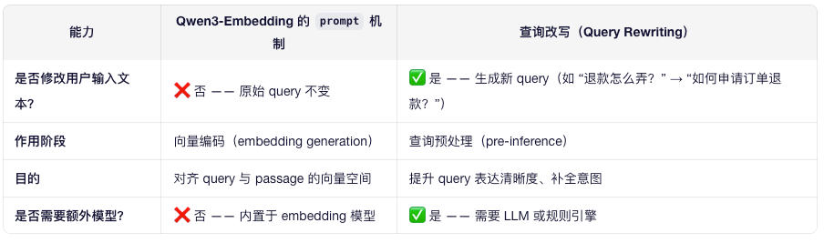

# instruction prompt 自动优化

> 它不是自动进行查询改写（query rewriting），而是 在向量编码阶段为原始 query 添加一个固定的指令前缀（instruction prompt），不改变用户输入的原始文本内容，仅影响其生成的 embedding 向量
 
 

## 举个例子
假设用户输入：

"退钱"

1. 使用 Qwen3-Embedding + prompt_name="query"：
实际输入模型的内容：
"Represent this sentence for searching relevant passages: 退钱"
但返回的 embedding 仍代表原始语义“退钱”，只是向量方向被引导到更适合检索的空间。
原始 query 文本未被改写，后续日志、审计、展示仍用 "退钱"。
2. 查询改写（如用 Qwen-Max）：
输出新 query："如何申请退款？"
后续流程完全使用新 query，原始 "退钱" 可能只用于记录。

## 为什么这样设计？
- 轻量高效：无需调用大模型改写，降低延迟和成本；
- 可逆可控：原始 query 完整保留，便于调试和合规；
- 专为检索优化：instruction tuning 已证明能显著提升 embedding 质量（见 MTEB 排行榜）。


```python
# 用户输入（保持原样）
user_query = "退钱"

# 编码时加 prompt（仅影响向量，不影响文本）
query_emb = model.encode(user_query, prompt_name="query")

# 用该向量去召回知识库文档
results = vector_db.search(query_emb, top_k=3)

# 最终回答仍基于原始 user_query + 检索结果
answer = llm.generate(f"用户问：{user_query}\n参考：{results}")
```

## 原理
Qwen3-Embedding-4B 并不是通过 Supervised Fine-Tuning (SFT) 训练的，而是通过大规模对比学习（Contrastive Learning）在海量（query, positive passage, negative passage）三元组上进行端到端训练的，且在训练时对 query 显式添加了固定指令前缀（instruction prefix）。

如果你正在构建 RAG 系统，记住：用 prompt_name="query" 是为了触发模型在训练中学到的“检索编码模式”，而不是因为它被 SFT 微调过。

“检索编码模式（retrieval-oriented encoding）”之所以能让检索更精准，核心在于它主动对齐了查询（query），从而在向量空间中实现语义匹配而非字面匹配。

### 那么它到底怎么训练的
根据 Qwen 官方技术惯例、ModelScope 页面描述 以及 同类模型（如 BGE、E5、Instructor）的公开方案，Qwen3-Embedding-4B 的训练流程如下：

1. 数据构建
   自动挖掘海量弱监督对：
   用户搜索 query ↔ 被点击的网页（来自日志）
   问答对：问题 ↔ 高质量答案（知乎、百度知道）
   维基百科：锚文本 ↔ 目标页面
   多语言平行语料、代码 issue ↔ 解决方案等
2. 输入格式（关键！）
   Query 输入："Represent this sentence for searching relevant passages: <原始query>"
   Passage 输入：<原始文档>（无前缀）
   
3. 这个指令作为训练数据的一部分，而非微调信号。

> 语言分布差异、训练目标、表示几何、任务适配 四个层面深入解释

### 一、问题根源：Query 与 Passage 的语言分布天然不一致

📉 如果用同一编码方式处理两者，它们的 embedding 会落在向量空间的不同区域，即使语义相关，余弦相似度也很低。

### 二、检索编码模式如何解决这个问题？
✅ 核心机制：通过指令前缀激活“语义泛化 + 关键意图提取”模式
当模型看到：

"Represent this sentence for searching relevant passages: 退钱"

它在训练中学到的行为是：

- 忽略口语/情绪：不关注“退钱”中的不满语气；
- 提取核心意图：识别出“退款”这一动作；
- 泛化到标准术语：将“退钱”映射到知识库中常见的“订单退款”“资金返还”等概念；
- 生成“理想匹配向量”：这个向量不是“退钱”的忠实表示，而是它在文档中最可能对应的语义中心。
- 
🎯 结果：
- Query 向量 ≈ “退款政策”类文档的平均向量
- Passage 向量 = 实际文档向量 → 二者在空间中高度接近


### 三、从表示几何看：压缩语义歧义，拉近相关点
假设没有检索编码模式：

"退钱" → 向量 A（靠近“讨债”“诈骗”等负面短句）
"如何申请退款？" → 向量 B（靠近客服文档）
→ A 与 B 距离远，召回失败。

使用检索编码模式后：

"Represent...: 退钱" → 向量 A'（被“拉”向客服文档簇）
"如何申请退款？" → 向量 B（不变）
→ A' 与 B 距离近，成功召回。

🔬 这相当于在向量空间中动态扭曲了 query 的位置，使其落入正确的语义“引力井”。

### 四、训练目标驱动：优化的是 Recall@k，不是语义保真
普通 sentence embedding（如早期 SBERT）的目标是：

“让语义相似的句子向量接近”

而 检索专用 embedding 的目标是：

“让 query 的向量尽可能接近所有相关文档的向量”

这意味着：

它可以牺牲 query 的原始语义细节（如情感、风格）；
换取更高的 top-k 召回率（Recall@10, Recall@100）。
💡 举个极端例子：

即使用户输入 "气死了，这破平台还不给退钱！"，

检索编码模式也会把它变成一个冷静、标准、指向“退款流程” 的向量。

### 五、类比：就像“专业翻译” vs “直译”

→ 后者更符合业务目标。

### 六、实证支持：MTEB 排行榜验证
在权威 benchmark MTEB 中：

BGE、E5、Qwen-Embedding 等使用 instruction 的模型，在 Retrieval 任务上显著优于 无 instruction 模型；
消融实验显示：移除 query prompt 会导致 Recall@10 下降 10%~20%。


