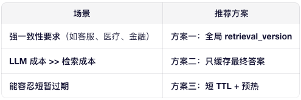

# RAG 各层缓存设计方案

在高并发大模型 API 服务中，RAG（Retrieval-Augmented Generation）是核心组件。为提升吞吐、降低延迟与推理成本，**分层缓存设计**至关重要。本文系统梳理 RAG 链路中可缓存的关键环节，并提供生产级缓存方案。

---

## 🧭 缓存设计原则

- **命中优先于计算**：任何可复用的中间结果或最终输出都应缓存。
- **语义感知**：支持 paraphrase（同义改写）查询的缓存命中。
- **分层架构**：L1（本地）→ L2（分布式）→ L3（语义/向量）多级缓存。
- **一致性保障**：文档更新时主动失效相关缓存。
- **可观测性**：监控各层缓存命中率、延迟、淘汰率。

---

---

## 🔹 1. Query Embedding 缓存

### 目标
避免重复调用 embedding 模型（如 `text-embedding-ada-002` 或自托管 Sentence Transformer）。

### 方案
- **Key**: `embed:{hash(normalized_query)}`
- **Value**: `{"embedding": [...], "timestamp": ...}`
- **归一化处理**：
  - 转小写
  - 去除多余空格/标点
  - Unicode 标准化（NFKC）
- **存储**：Redis / Memcached（TTL 24h–7d）
- **命中收益**：节省 10–100ms 网络 + 计算开销

> ✅ 适用于所有基于向量检索的 RAG 系统。

---

## 🔹 2. 向量检索结果缓存

### 目标
避免重复查询向量数据库（如 Milvus、Pinecone、FAISS）。

### 方案
- **Key**: `retrieval:{query_hash}` 或 `retrieval:{embedding_hash}`
- **Value**: `{"chunk_ids": [...], "scores": [...], "texts": [...]}`  
  （可只存 ID，按需加载文本）
- **注意**：
  - 若使用近似搜索（ANN），相同 query 应返回稳定结果（固定 `nprobe`/`ef_search`）
  - 可缓存 Top-K 结果（K 固定）

### 存储建议
- Redis（热数据）
- 若结果较大，可存入对象存储（S3）+ Redis 存 URL（冷热分离）

> ⚠️ 文档库更新时需失效：建立 `doc_id → query_hash[]` 反向索引。

---

## 🔹 3. Prompt 构建缓存

### 目标
跳过“检索结果 → 提示词模板填充”这一确定性步骤。

### 方案
- **Key**: `prompt:{query_hash}:{sorted_chunk_ids_hash}`
- **Value**: 完整 prompt 字符串（含 system/instruction/retrieved context）
- **适用场景**：
  - 固定 prompt 模板
  - 检索结果顺序稳定（如按 score 排序）

> ✅ 此缓存使后续 LLM 推理可直接命中 response cache。

---

## 🔹 4. LLM 最终响应缓存

### 目标
避免重复调用大模型生成相同回答。

### 方案
- **Key**: `response:{hash(prompt)}`
- **Value**: `{"output": "...", "model": "llama3-70b", "temperature": 0, ...}`
- **限制条件**：
  - 仅缓存 `temperature=0` 或 `seed` 固定的 deterministic 输出
  - 若需支持随机性，可缓存多个采样结果并打标签

### 存储
- Redis（高频）
- 对长文本响应，可压缩后存储（如 gzip）

> 💡 在客服、FAQ、文档问答等场景，命中率可达 30%–70%。

---

## 🔹 5. 语义缓存（Semantic Cache）

### 目标
解决 **paraphrase 问题**：不同表述但语义相同的查询应命中同一缓存。

### 方案
1. 使用轻量 embedding 模型（如 `all-MiniLM-L6-v2`）计算 query 语义向量
2. 构建专用 **语义缓存向量库**：
  - 存储：`(query_embedding → response)`
  - 索引：HNSW / IVF（低维，<512d）
3. 查询流程：
  - 新 query → 计算 embedding
  - 在语义缓存库中 ANN 搜索
  - 若 top-1 相似度 > 阈值（如 cosine > 0.95），则复用 response

### 优势
- 显著提升缓存覆盖率
- 减少对主向量库和 LLM 的压力

> 🌐 可视为“缓存的缓存”，适用于开放域问答。

---

## 🔹 6. KVCache 共享（底层推理缓存）

> 虽非 RAG 特有，但对 RAG 性能影响巨大。

### 场景
RAG 中大量请求使用**相同系统提示（system prompt）或模板前缀**。

### 方案
- 使用支持 **前缀共享** 的推理引擎：
  - **SGLang**：RadixAttention 自动共享公共前缀 KVCache
  - **vLLM**：通过 PagedAttention + 手动前缀池（实验性）
- 外置 KVCache（如 Mooncake）实现跨实例共享

### 效果
- Prefill 阶段计算减少 50%+
- 高并发下吞吐提升 2–5 倍

---

## 🔄 缓存失效策略

| 触发事件 | 失效范围 | 实现方式                             |
|--------|--------|----------------------------------|
| 文档内容更新 | 所有引用该 doc 的检索结果 & prompt & response | 利用反向索引，消息队列广播 `doc_id`，缓存服务监听并删除 |
| Prompt 模板变更 | 所有 prompt/response 缓存 | 版本化 Key：`v2:response:{hash}`     |
| 模型升级 | 所有 LLM response 缓存 | 清空或加 model version 到 key         |
| 定期清理 | 冷数据 | TTL + LRU 淘汰                     |

RAG 文档新增时怎么处理缓存

---

## 📊 监控指标建议

| 指标 | 说明 |
|-----|------|
| `cache.hit_rate.total` | 整体缓存命中率 |
| `cache.hit_rate.by_layer` | 分层命中率（embedding / retrieval / response） |
| `cache.latency.p50/p99` | 缓存访问延迟 |
| `cache.eviction_rate` | 缓存淘汰频率（反映容量是否充足） |
| `llm.calls.saved_per_minute` | 因缓存避免的 LLM 调用次数 |

---

## ✅ 总结：实施路线图

1. **第一阶段**：部署 `Query Embedding Cache` + `LLM Response Cache`（ROI 最高）
2. **第二阶段**：增加 `Retrieval Cache` + `Prompt Cache`
3. **第三阶段**：引入 `Semantic Cache` 提升覆盖率
4. **第四阶段**：集成 `KVCache 共享`（SGLang + Mooncake）优化底层推理
5. **持续**：建立缓存监控 + 自动失效机制

> 通过多级缓存协同，RAG 服务可在保持语义准确性的前提下，**降低 50%+ LLM 调用成本，提升 3–10 倍吞吐能力**。

--- 

> 📌 **提示**：缓存不是银弹！需结合业务特性（如数据更新频率、查询分布）动态调整策略。