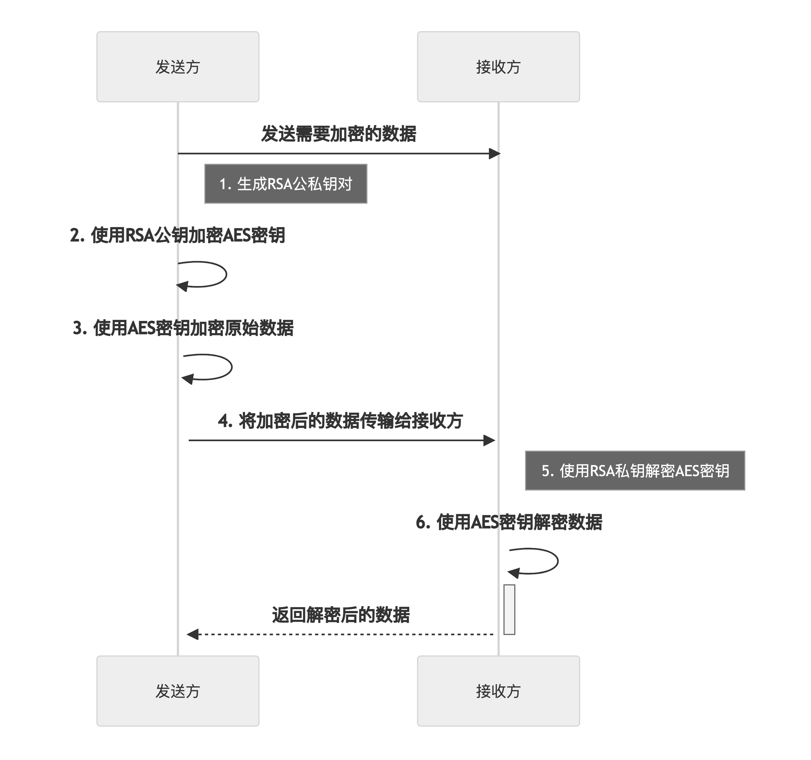

# RSA

非对称加密，使用公钥和私钥加密和解密，加密速度慢，公私钥分离安全性较高

具有以下特点：
- 安全性较高：RSA算法采用非对称加密方式，使用不同的公钥和私钥进行加密和解密，公钥用于加密，私钥用于解密，这种机制保证了加密数据的安全性。
- 适用性广泛：RSA算法广泛应用于数字签名、加密通信、身份认证等领域，在互联网和电子商务中被广泛使用。
- 非对称性：RSA算法采用非对称加密方式，使用不同的公钥和私钥进行加密和解密，公钥用于加密，私钥用于解密。
- 数学难题：RSA算法的安全性基于两个大质数的乘积的因数分解问题，其复杂度在目前的计算机技术下是很难解决的。
- 加密速度较慢：RSA算法加密速度相对较慢，因为RSA算法需要使用大质数的运算，复杂度较高。
- 密钥管理：RSA算法需要管理公钥和私钥，如果密钥管理不当，密钥可能会泄露或被攻击者获取。


# AES
对称加密，加密和解密使用同一个密钥，加密速度快

具有以下特点：

- 安全性高：AES算法被广泛使用，其安全性得到了许多专家和组织的认可。在合适的密钥长度和实现条件下，AES算法可以提供很高的加密强度。
- 算法简单：AES算法的加密和解密过程相对简单，可以在各种设备和平台上轻松实现。
- 高效性：AES算法的加密和解密速度非常快，可以快速处理大量数据。
- 灵活性：AES算法可以使用不同的密钥长度进行加密，包括128比特、192比特和256比特。
- 实用性强：AES算法在许多领域得到广泛应用，如金融、电子商务、通信等。

# RSA+AES 混合加密
## 为什么需要混合加密
因为AES加密速度快，自然是我们的第一选择，但是缺点也明显。因为使用同一个密钥，如果有一方密钥泄露，那么数据也就不安全了。所以我们可以结合RSA互补二者的缺点，使用RSA来加密传递AES密钥，用AES来加密数据。

## 加密的步骤如下：

1. 发送方首先生成RSA公私钥对。公钥可以公开发布，私钥应保密保存。
2. 发送方使用RSA公钥加密AES密钥。这样，只有持有RSA私钥的接收方才能解密AES密钥。
3. 发送方使用AES密钥加密原始明文数据。这样，只有持有AES密钥的接收方才能解密原始数据。
4. 发送方将加密后的数据传输给接收方。这可以是通过网络传输或其他通信渠道完成的。

## 解密的步骤如下：

1. 接收方使用RSA算法解密接收到的AES密钥，得到明文的AES密钥。

2. 接收方使用解密后的AES密钥解密接收到的密文数据，得到明文数据。


需要注意的是，RSA算法和AES算法分别使用自己的密钥进行加密和解密，其中RSA算法的公钥用于加密，私钥用于解密；AES算法的密钥用于加密和解密。整个加密过程采用了混合加密的方式，充分利用了RSA算法和AES算法各自的优势，提高了加密的安全性和效率。

## Java 示例代码：

```java
import javax.crypto.*;
import javax.crypto.spec.*;
import java.security.*;

public class RSAAndAesMixedEncryption {

    public static void main(String[] args) throws Exception {

        // 生成RSA密钥对
        KeyPairGenerator rsaKeyPairGen = KeyPairGenerator.getInstance("RSA");
        rsaKeyPairGen.initialize(2048);
        KeyPair rsaKeyPair = rsaKeyPairGen.generateKeyPair();

        // 生成随机的AES密钥
        KeyGenerator aesKeyGen = KeyGenerator.getInstance("AES");
        aesKeyGen.init(256);
        SecretKey aesKey = aesKeyGen.generateKey();

        // 明文待加密
        String plainText = "Hello, world!";

        // 使用AES加密明文
        Cipher aesCipher = Cipher.getInstance("AES/CBC/PKCS5Padding");
        aesCipher.init(Cipher.ENCRYPT_MODE, aesKey);
        byte[] encryptedText = aesCipher.doFinal(plainText.getBytes());

        // 使用RSA加密AES密钥
        Cipher rsaCipher = Cipher.getInstance("RSA");
        rsaCipher.init(Cipher.ENCRYPT_MODE, rsaKeyPair.getPublic());
        byte[] encryptedAesKey = rsaCipher.doFinal(aesKey.getEncoded());

        // 在客户端将加密后的AES密钥和加密后的数据发送给服务器

        // 服务器接收到数据后，使用RSA解密AES密钥
        rsaCipher.init(Cipher.DECRYPT_MODE, rsaKeyPair.getPrivate());
        byte[] decryptedAesKey = rsaCipher.doFinal(encryptedAesKey);
        SecretKeySpec aesKeySpec = new SecretKeySpec(decryptedAesKey, "AES");

        // 使用解密后的AES密钥解密数据
        aesCipher.init(Cipher.DECRYPT_MODE, aesKeySpec, new IvParameterSpec(aesKey.getEncoded()));
        byte[] decryptedText = aesCipher.doFinal(encryptedText);

        // 输出解密后的数据
        System.out.println(new String(decryptedText));
    }
}
```
