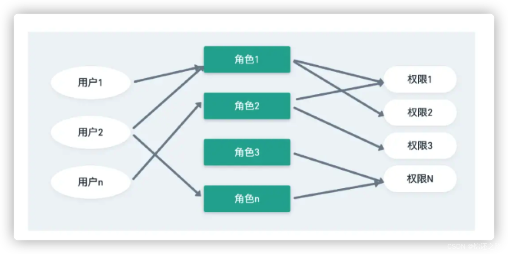
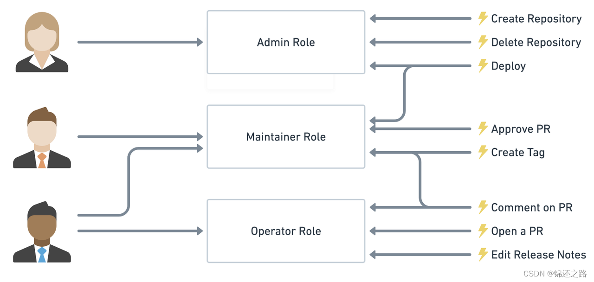
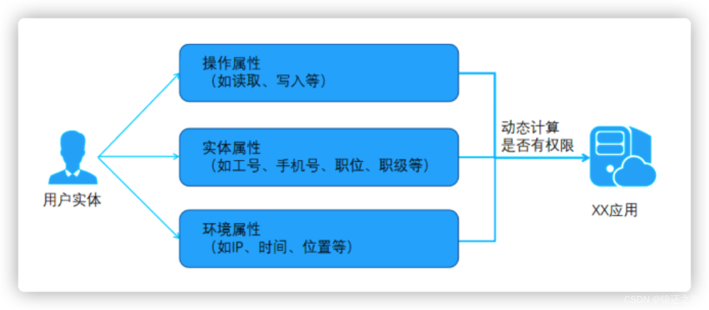
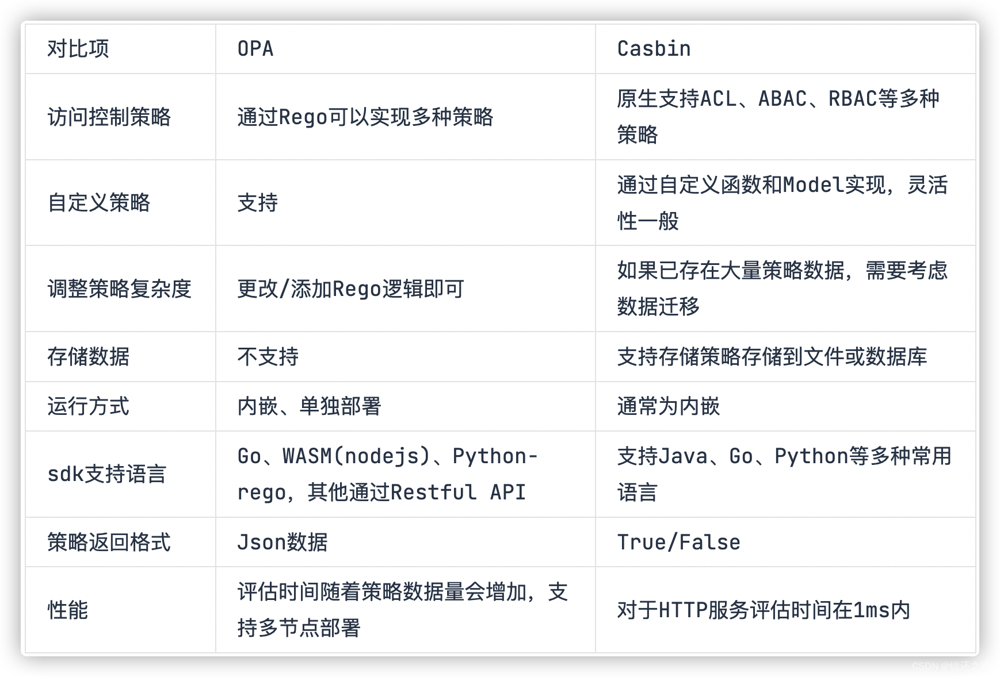
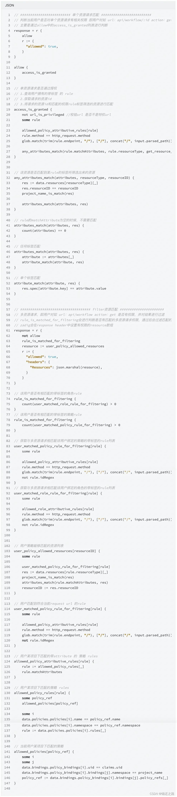

# OPA 实现 ABAC 权限模型

# 权限模型
目前，基于角色的访问控制（RBAC）和基于属性的访问控制（ABAC）是被大家广泛采用的两种权限模型，二者各有优劣。
RBAC 模型构建起来更加简单，缺点在于无法做到对资源细粒度地授权（都是授权某一类资源而不是授权某一个具体的资源）；ABAC 模型构建相对比较复杂，学习成本比较高，优点在于细粒度和根据上下文动态执行。

## 基于角色的访问控制（RBAC）
### 什么是 RBAC？
基于角色的访问控制（Role-based access control，简称 RBAC），指的是通过用户的角色（Role）赋予其相关权限，这实现了细粒度的访问控制，并提供了一个相比直接授予单个用户权限，更简单、可控的管理方式。

当使用 RBAC 时，通过分析系统用户的实际情况，基于共同的职责和需求，将他们分配给不同的角色。然后可以授予每个用户一个或多个角色，每个角色具有一个或多个权限，这种 用户-角色、角色-权限 间的关系，让我们可以不用再单独管理单个用户，用户从具备的角色里面继承所需的权限，从而使得用户赋权这件事变得更加简单。

### RBAC 的使用场景
以一个简单的场景为例（Gitlab 的权限系统），用户系统中有 Admin、Maintainer、Operator 三种角色，这三种角色分别具备不同的权限，比如只有  Admin 具备创建代码仓库、删除代码仓库的权限，其他的角色都不具备。

我们授予某个用户「Admin」这个角色，他就具备了「创建代码仓库」和「删除代码仓库」这两个权限。

不直接给用户授权策略，是为了之后的扩展性考虑。比如存在多个用户拥有相同的权限，在分配的时候就要分别为这几个用户指定相同的权限，修改时也要为这几个用户的权限进行一一修改。有了角色后，我们只需要为该角色制定好权限后，将相同权限的用户都指定为同一个角色即可，便于权限管理。

## 基于属性的访问控制（ABAC）
### 什么是 ABAC？
基于属性的访问控制（Attribute-Based Access Control，简称 ABAC）是一种灵活的授权模型，通过一个或一组属性来控制是否有对操作对象的权限。

其中，ABAC 中的 A，也就是属性（Attribute），用于表示 subject、object 或者环境特征的特点，属性使用 key-value 的形式来存储这些信息，比如我在公司的 role 是 developer，role 是 key，developer 是 value。

ABAC 属性通常来说分为四类：用户属性（如用户年龄），环境属性（如当前时间），操作属性（如读取）和对象属性（如一篇文章，又称资源属性），所以理论上能够实现非常灵活的权限控制。

### ABAC 的使用场景
比如，在北京的公司员工明天将用公司内网参加会议培训。其中，「北京」、「公司内网」是环境属性，「参加会议培训」是操作属性。在需要根据这些属性来动态计算权限的时候，RBAC 授权模型将无法满足需求。这个时候就需要使用 ABAC 授权模型。

在 ABAC 权限模型下，你可以轻松地实现以下权限控制逻辑：
1. 授权某编辑具体某本书的编辑权限；
2. 当一个文档的所属部门跟用户的部门相同时，用户可以访问这个文档；
3. 当用户是一个文档的拥有者并且文档的状态是草稿，用户可以编辑这个文档；
4. 早上九点前禁止 A 部门的人访问 B 系统；
5. 在除了上海以外的地方禁止以管理员身份访问 A 系统；

上述的逻辑中有几个共同点：
1. 具体到某一个而不是某一类资源；
2. 具体到某一个操作；
3. 能通过请求的上下文（如时间、地理位置、资源 Tag）动态执行策略；

如果浓缩到一句话，你可以细粒度地授权在何种情况下对某个资源具备某个特定的权限。
ABAC 则是通过动态计算一个或一组属性是否满足某种条件来进行授权判断（可以编写简单的逻辑）。属性通常来说分为四类：用户属性（如用户年龄），环境属性（如当前时间），操作属性（如读取）和对象属性（如一篇文章，又称资源属性），所以理论上能够实现非常灵活的权限控制，几乎能满足所有类型的需求。

RBAC 授权模型是基于角色的访问控制，当面对大型企业与组织时，RBAC 授权模型需要维护大量的角色和授权关系，ABAC 授权模型则会更加灵活。此外，当资源不断增多时，RBAC 授权模型需要维护所有的相关角色，而 ABAC 授权模型只需根据相关属性进行维护，有更强的拓展性。

# 第三方策略决策引擎
## 为什么需要策略决策引擎
大型软件中各个组件都需要进行一些策略控制，比如用户权限校验、创建资源校验、某个时间段允许访问，如果每个组件都需要实现一套策略控制，那么彼此之间会不统一，维护困难。一个自然的想法是能否将这些策略逻辑抽离出来，形成一个单独的服务，同时这个服务可能需要提供各种不同 sdk 来屏蔽语言差异。
OPA 正是解决这个问题，将散落在系统各处的策略进行统一，所有服务直接请求 OPA 即可。通过引入OPA 可以降低系统耦合性，减少维护复杂度。

## Casbin 与 OPA 对比
[Open Policy Agent vs Casbin](https://qingwave.github.io/openpolicyagent-vs-casbin/#open-policy-agent)

## OPA 实现 ABAC
关键代码(rego)

# 相关资料
[https://www.openpolicyagent.org/docs/latest/](https://www.openpolicyagent.org/docs/latest/)
[https://www.openpolicyagent.org/docs/latest/comparison-to-other-systems/#attribute-based-access-control-abac](https://www.openpolicyagent.org/docs/latest/comparison-to-other-systems/#attribute-based-access-control-abac)
[Zadig 基于 OPA 实现 RBAC 和 ABAC 权限管理](https://mp.weixin.qq.com/s/C3dQknBHIBi8GqoT4T27mA)
[Zadig Contributor Bootcamp 第四期：Zadig 基于 OPA 实现 RBAC 和 ABAC 权限管理技术方案详解_哔哩哔哩_bilibili](https://www.bilibili.com/video/BV1Tu411i76P/?spm_id_from=333.788&vd_source=ced72473b019cfa41d5ffe1b8deaba65)
[Example 1: Basic ABAC with OPA and Rego - AWS Prescriptive Guidance](https://docs.aws.amazon.com/prescriptive-guidance/latest/saas-multitenant-api-access-authorization/abac-examples.html)
[初探 Open Policy Agent 實作 RBAC (Role-based access control) 權限控管](https://blog.wu-boy.com/2021/04/setup-rbac-role-based-access-control-using-open-policy-agent/)

