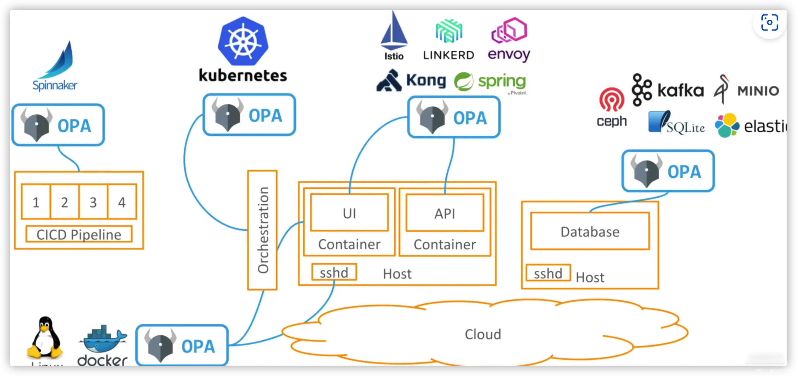
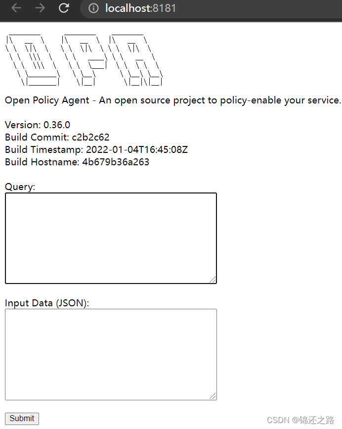
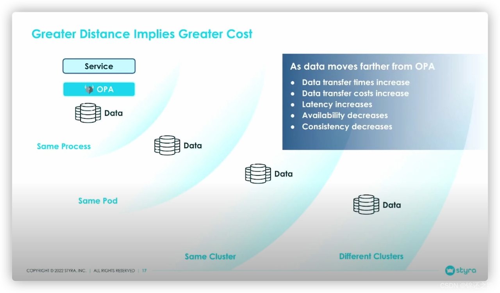
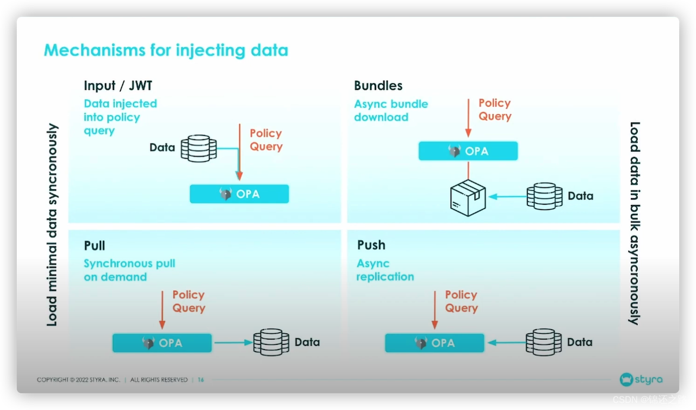
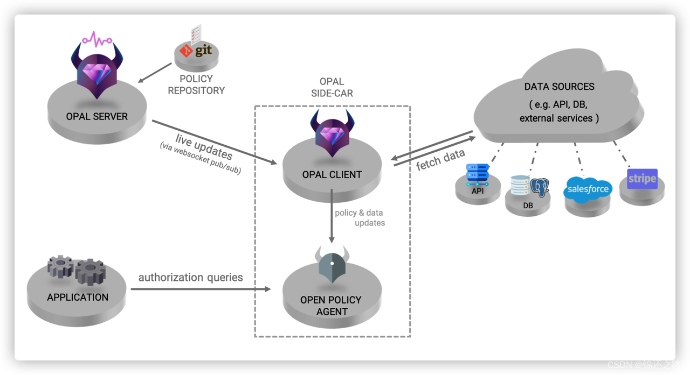

# 策略决策引擎之 OPA 与 Drools
策略决策引擎是一种可以根据复杂的决策规则，对不同的业务场景进行智能化的决策支持的工具1。需要策略决策引擎的原因有以下几点：

- 解耦业务逻辑和策略规则：策略决策引擎可以将业务逻辑和策略规则分离，使得业务逻辑更加清晰，策略规则更加灵活，便于维护和更新。
- 提高决策效率和精度：策略决策引擎可以利用图形化的界面，快速地设计和配置复杂的决策流和决策树，减少人为的错误和遗漏，提高决策的效率和精度。
- 支持多种业务场景：策略决策引擎可以根据不同的业务需求，灵活地调整和优化决策规则，支持多种业务场景，如风险管理、电销、电催、精细化运营等

规则引擎的优势

- 业务规则与系统代码分离，实现业务规则的集中管理
- 在不重启服务的情况下可随时对业务规则进行扩展和维护
- 可以动态修改业务规则，从而快速响应需求变更
- 规则引擎是相对独立的，只关心业务规则，使得业务分析人员也可以参与编辑、维护系统的业务规则
- 减少了硬编码业务规则的成本和风险
- 使用规则引擎提供的规则编辑工具，使复杂的业务规则实现变得的简单

# OPA 是什么
[https://www.openpolicyagent.org/docs/latest/](https://www.openpolicyagent.org/docs/latest/)

Open Policy Agent (OPA) 是一个开源的通用策略引擎，可以在整个堆栈中实现统一、上下文感知的策略控制。OPA 的主要特点有：

- 声明式的策略语言：OPA 使用一种名为 Rego 的高级声明式语言来编写策略，Rego 可以表达复杂的逻辑和数据分析，支持 JSON 和 YAML 格式的数据。
- 简单的策略接口：OPA 提供了简单的 RESTful API 和 gRPC API 来查询和更新策略，以及获取策略决策的结果。
- 灵活的策略部署：OPA 可以以多种方式部署，包括作为一个独立的服务，作为一个嵌入式的库，或者作为一个 Kubernetes 的 Admission Controller。

Open Policy Agent 是一个云原生计算基金会 (CNCF) 的毕业项目，已经被许多知名的公司和组织使用，如 Netflix, Pinterest, Capital One, Atlassian

OPA 的具体决策执行流程如下上层服务接口可以对接不同的服务。策略决策与策略执行分离，OPA 并不负责具体任务的执行，它仅负责决策。当您的软件需要做出策略决策时，它会查询 OPA 并提供结构化数据（例如 JSON）作为输入。在 OPA 决策后，也会将结果以 JSON 的形式返回。

# OPA 应用场景

- 容器安全：可以通过 Open Policy Agent 控制容器访问的权限以及容器之间的通信，并保障容器的安全。
- 云安全：通过 Open Policy Agent 设置云平台的安全策略，以保障云平台的安全性。
- API 网关：通过 Open Policy Agent 对 API 的请求和响应进行验证和授权，以实现 API 的访问控制。
- 微服务：通过 Open Policy Agent 对微服务之间的调用进行策略控制，以实现服务治理。

OPA 的出现可以将各处配置的策略进行统一，极大的降低了维护成本。以及将策略与对应的软件/服务进行解耦，方便进行移植/复用

# OPA 部署
OPA 通常有两种部署方式
- 作为 Go 库：可以把 OPA 作为应用程序中的第三方库来实现。
- 作为守护程序：OPA 作为一个服务运行并通过 HTTP 执行。默认情况下，OPA 会监听在 8181 端口。

## 集群方式

## 数据交互方式

# OPAL

> OPAL = OPA + 事件驱动



# OPA 实现权限管理
[初探 Open Policy Agent 實作 RBAC (Role-based access control) 權限控管](https://blog.wu-boy.com/2021/04/setup-rbac-role-based-access-control-using-open-policy-agent/)

[Zadig 基于 OPA 实现 RBAC 和 ABAC 权限管理](https://mp.weixin.qq.com/s/C3dQknBHIBi8GqoT4T27mA)
# Drools 是什么

> [https://drools.org/](https://drools.org/)

Drools 是一个基于规则的系统，用于实现和管理业务逻辑。它是一个开源的 Java 项目，由 JBoss 和 Red Hat 支持。它可以处理事实和规则，并产生输出结果。
- Drools 是一个基于规则的系统，可以将业务逻辑从应用程序代码中分离出来，使其更容易理解和维护。
- Drools 提供了一个强大的规则引擎，可以快速和可靠地评估业务规则和复杂事件处理。
- Drools 支持决策模型和符号 (DMN) 模型的完整运行时支持，以及一个 Eclipse IDE 插件，用于核心开发。
- Drools 还提供了一个 web 作者和规则管理应用程序 (Drools Workbench)，可以让业务人员和技术人员协同工作，创建和管理规则。

# Drools 示例
先安装 Drools  Maven 依赖。
[https://mvnrepository.com/artifact/org.drools/drools-core](https://mvnrepository.com/artifact/org.drools/drools-core)

然后你需要创建一个 KieSession 对象，用于加载规则文件和插入事实对象。最后你需要调用 fireAllRules() 方法，让 Drools 执行所有匹配的规则。下面是一个运行示例的代码

```java
package com.xxx.drools.model;

public class Person {
    private String name;
    private int age;
    private boolean adult;

    public Person(String name, int age) {
        this.name = name;
        this.age = age;
    }

    // getters and setters
}
```

```java
package com.xxx.drools.rules;

rule "Is Adult"
when
    $p : Person(age >= 18)
then
    $p.setAdult(true);
end
```


```java
package com.xxx.drools;

import com.baeldung.drools.model.Person;
import org.kie.api.KieServices;
import org.kie.api.runtime.KieContainer;
import org.kie.api.runtime.KieSession;

public class DroolsApplication {

    public static void main(String[] args) {
        KieServices kieServices = KieServices.Factory.get();
        KieContainer kContainer = kieServices.getKieClasspathContainer();
        KieSession kSession = kContainer.newKieSession("ksession-rules");

        Person john = new Person("John", 20);
        Person paul = new Person("Paul", 15);

        kSession.insert(john);
        kSession.insert(paul);

        kSession.fireAllRules();

        System.out.println(john.isAdult());
        System.out.println(paul.isAdult());
    }
}
```

# Drools 与 OPA 对比

|  |  Drools| OPA|
|--|--|--|
| 开发语言 | Java | Go |
| 源码地址 | https://github.com/kiegroup/drools | https://github.com/open-policy-agent/opa |
| 执行优化 | RETE + PHREAK 算法 | Rule Indexing |
| DSL | Drools（类似 Java 语法） | Rego（声明式的设计源于 Datalog ） |
| 输入输出 | Java 实体类 | JSON |
| 优先级配置 | 支持 | 需要多次交互实现 |
| 并行支持 | 支持 | 支持 |
| 性能开销 | 初始化时将规则编译成字节码的耗时 | Go 之外的语言需要走 Http |
| 学习成本 | Java 开发者友好 | Go 开发者友好 |
| 优势 | 规则语法与 Java 相似，在规则中能方便引入工具包，调用外部服务 | 规则语法与 Go 相似，使用 http 交互简单 |
| 劣势 | Drools 相关的组件太多，架构搭建成本较高 | 需要部署单独服务，使用 http 交互，与 Java 服务结合不够灵活 |


